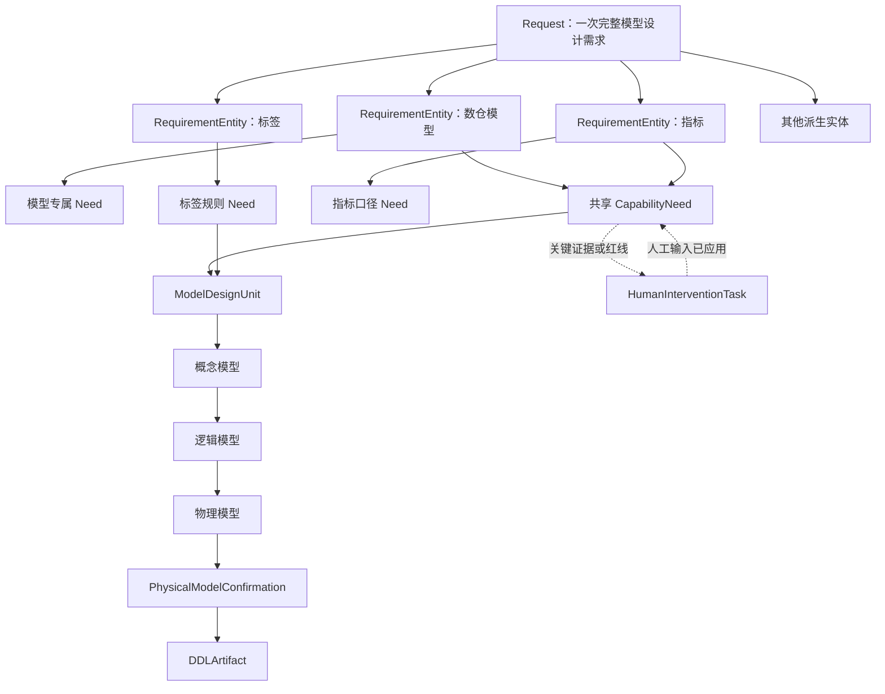
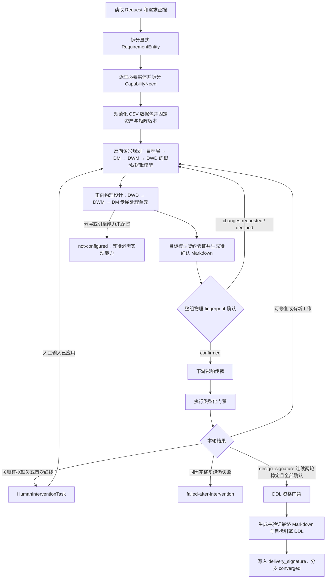
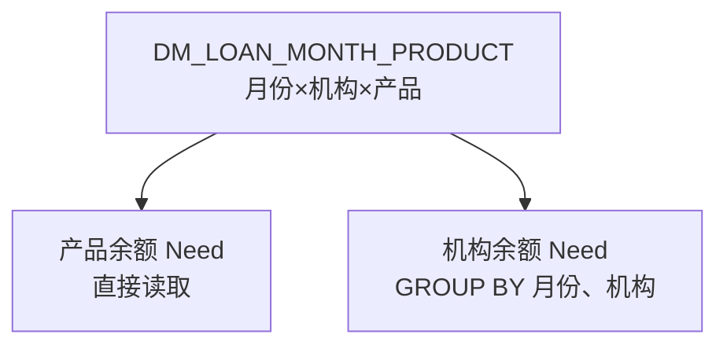

# dw-model-creator 核心工作流（模型设计版）

> 文档状态：由 workflow.md 拷贝调整，Skill 边界缩减至数仓模型设计；核心流程沿用原文档
> 适用阶段：一期
> 更新日期：2026-08-20
> 边界调整：移除报表、离线文件、API、推送等应用实体设计与应用端验证链；保留三阶段模型设计、分层物理设计、物理确认与 DDL 生成

## 目录

- [1. 目标与一期边界](#1-目标与一期边界)
- [2. 核心原则](#2-核心原则)
- [3. 运行时对象模型](#3-运行时对象模型)
- [4. 数仓模型设计](#4-数仓模型设计)
- [5. 核心工作流](#5-核心工作流)
- [6. 外层固定点](#6-外层固定点)
- [7. 混合粒度处理](#7-混合粒度处理)
- [8. 严格依赖与防循环规则](#8-严格依赖与防循环规则)
- [9. 状态和门禁](#9-状态和门禁)
- [10. 模型推理与确定性脚本职责](#10-模型推理与确定性脚本职责)
- [11. 类型与字段说明规范](#11-类型与字段说明规范)
- [12. 一期验收场景](#12-一期验收场景)

## 1. 目标与一期边界

本工作流用于把一个银行数仓模型设计需求拆解为可递归求解、可追溯、可校验的需求实体和最小能力单元，并形成语义定义、DM/DWM/DWD 模型设计及目标引擎 DDL；未指定引擎时默认使用 PostgreSQL。

一期约束：

- 一个 Request 可以包含数仓模型、指标和标签等多个 RequirementEntity；报表、离线文件、API、推送等应用实体需求不在 Skill 边界内，需要使用方先转化为模型设计需求。
- 每个 RequirementEntity 拆分为多个 CapabilityNeed；CapabilityNeed 是递归队列中的最小处理单元。
- 需求定义和缺口分析按需求端目标层模型向上游反向展开：目标层 → DM → DWM → DWD。
- 正向过程只负责从 DWD → DWM → DM → 目标层验证可实现性、字段绑定和影响，不重新定义模型需求。
- 所有数仓领域结构化数据均以 UTF-8 CSV 文件持久化和交换；多值与嵌套关系拆分为关联 CSV，不在单元格内保存 JSON。宿主平台强制的 Skill 发现元数据不属于该领域数据契约，但不得承载业务配置或运行状态。
- 每个新建、扩展或复用的数仓模型都必须具有可追溯的概念模型、逻辑模型和物理模型三个阶段产物。
- DWD、DWM、DM 分别预留独立的物理设计处理单元；当前先定义统一接口和门禁，具体分层设计流程后续补充。
- 只有物理模型经确认且字段类型、字段说明和门禁完整后，才能生成 DDL。
- 缺少关键证据或命中红线时先进入人工介入；应用人工结论后必须重新执行反向求解，复核仍失败才形成最终失败。
- 所有对象类型、枚举值、CSV 字段和数仓模型字段都必须提供中文说明。
- 所有物理依赖严格遵守版本化依赖矩阵；未声明的边默认禁止。
- 默认用户交付物为 Markdown；物理模型确认并满足 DDL 门禁后才生成 DDL，未指定引擎时使用 PostgreSQL。
- Skill 只输出设计和变更建议，不修改生产资产库或实施生产作业。

## 2. 核心原则

1. **反向定义，正向验证**：先从需求端确定字段和粒度，再递归推导 DM、DWM、DWD 缺口；完成反向闭包后，再从 DWD 向需求端目标层验证。
2. **交付范围不等于分析范围**：用户可以只要求单个目标层模型设计，但内部仍需分析支撑该模型的上游语义和物理能力。
3. **Need 是最小处理单元**：字段、指标、标签、粒度约束或非功能能力分别处理、分别绑定、分别记录状态。
4. **需求与解决状态共存但不混淆**：CapabilityNeed 内同时保存 requirement 和 resolution；求解过程中不得静默改写 requirement。
5. **共享来源不等于相互依赖**：多个 Need 可以共享同一个 DM 字段或数据集，但普通聚合不得被建模为两个应用 Need 之间的 `semantic_dependency_refs[]` 或 `subneed_links[]`。
6. **一个实体可以拥有多个粒度**：RequirementEntity 没有唯一粒度；度量、指标和标签声明唯一原生粒度，维度键声明参加的粒度集合，其他字段引用其适用粒度。
7. **不虚构资产**：资产目录证据不足时可以继续候选设计，但不得把未验证方案判定为正式新建。
8. **依赖矩阵既驱动路径又执行门禁**：矩阵用于限定候选类型、生成必要中间层，并校验每一条拟议依赖边。
9. **固定点不是队列为空**：只有能力、绑定、计划图、影响范围和校验结果整体稳定，才视为收敛。
10. **模型设计不可跳级**：每个数仓模型都按概念模型 → 逻辑模型 → 物理模型推进；下游阶段只能引用已确认的上游阶段。
11. **物理确认先于 DDL**：DDL 是已确认物理模型的确定性渲染结果，不能反过来代替物理模型设计或确认。
12. **人工介入是求解回路的一部分**：关键证据缺失或红线首次失败不会直接终止；人工输入被版本化后，受影响 Need 重新进入反向求解。
13. **数据契约完全显式**：所有结构化数据使用 CSV，所有类型、字段、枚举值及引用关系均通过数据字典说明。

## 3. 运行时对象模型

### 3.1 对象层级



状态自下而上聚合：

```text
CapabilityNeed / EntityUsage 状态
+ ModelDesignUnit / PhysicalModelConfirmation 状态
+ HumanInterventionTask 状态
→ RequirementEntity 状态
→ Request 状态
```

### 3.2 Request

Request 表示一次完整需求，可以包含多个相互关联的显式或派生实体。至少记录：

| 字段 | 说明 |
|---|---|
| `request_id` | 本次需求的稳定 ID |
| `objective` | 业务目标和要解决的问题 |
| `requested_outputs` | 用户要求交付的产物范围 |
| `analysis_scope` | 为保证正确性必须检查的内部范围 |
| `entity_refs` | 本次包含的 RequirementEntity |
| `evidence_refs` | 需求、资产、口径和用户确认的证据 |
| `assumptions` | 为推进草案采用的显式假设 |
| `status` | draft、human-review-required、awaiting-physical-confirmation、ready-for-review 或 failed |
| `termination_outcome` | in-progress、converged、awaiting-human、awaiting-physical-confirmation、awaiting-layer-implementation、failed-after-intervention、nonconvergent 或 internal-failure |
| `run_state_ref` | 本次固定点执行状态的引用 |

`requested_outputs` 只控制最终交付，不得阻止内部向 DM、DWM、DWD 递归分析。

### 3.3 RequirementEntity

RequirementEntity 是具有独立目标、Owner、版本和交付契约的需求对象。类型至少包括：

| 类型代码 | 说明 |
|---|---|
| `metric` | 驱动模型设计、具有独立口径、粒度、公式和版本的指标需求；其应用发布不在 Skill 边界内 |
| `tag` | 驱动模型设计、基于字段或指标规则识别目标对象的标签需求；其应用发布不在 Skill 边界内 |
| `physical-model` | 用户显式提出的 DWD、DWM 或 DM 数仓模型需求；仍须执行三阶段设计 |

报表、离线文件、API、推送等应用实体类型已移出 Skill 边界；相关需求需要使用方先转化为上述模型设计需求。

一个实体既可以由用户显式提出，也可以在递归过程中派生。例如模型设计使用了尚未定义口径的指标时，可以派生指标实体。

每个实体至少记录：

| 字段 | 说明 |
|---|---|
| `entity_id` | 稳定 ID |
| `entity_type` | 模型、指标、标签等类型 |
| `origin` | explicit 或 derived |
| `goal` | 该实体解决的问题 |
| `owner` | 业务和数据责任人 |
| `version` | 实体契约版本 |
| `need_refs` | 该实体直接引用的 CapabilityNeed |
| `entity_dependencies` | 对其他独立实体的真实契约依赖 |
| `type_payload` | 随实体类型变化的交付或治理契约 |
| `status` | 从必需 Need 状态确定性聚合 |

“指标”作为独立语义对象时建立 metric RequirementEntity；模型中的对应字段 Need 引用该指标实体，不重复定义口径。

`type_payload` 至少覆盖以下差异：

| 实体类型 | 类型化契约重点 |
|---|---|
| metric | 原子/派生类型、口径版本、公式、粒度和聚合行为 |
| tag | 规则表达式、输入能力、值域、刷新周期和目标对象 |
| physical-model | `target_layer`、`model_role`、目标粒度、主键和时态策略 |

### 3.4 CapabilityNeed

CapabilityNeed 同时包含需求描述和当前解决状态，是递归工作队列中的最小单元。

Need 类型至少包括：

| 类型代码 | 说明 |
|---|---|
| `grain` | 定义能力成立时的唯一性维度组合和时间语义 |
| `dimension-key` | 参与粒度、连接、分组或识别业务对象的维度键 |
| `dimension-attribute` | 由维度键确定、用于展示或筛选的描述属性 |
| `measure` | 在原生粒度上可观测、可按规则聚合的数值事实 |
| `metric` | 具有受治理口径、公式、粒度和版本的指标能力 |
| `tag` | 根据规则产生分类或布尔结果的标签能力 |
| `non-functional` | SLA、权限、保留和审计能力 |

CapabilityNeed 采用“公共 Envelope + 按 `need_type` 区分的 payload + resolution”的联合结构。Need 与绑定仍是同一个最小处理单元，不另建顶层 CapabilityBinding；实体使用上下文、上游子能力和物理绑定都作为 Need 内的结构化成员保存。

公共 Envelope 至少包含：

| 区域 | 字段 | 说明 |
|---|---|---|
| 标识 | `need_id` | 稳定且唯一的 Need ID |
| 标识 | `need_version` | requirement 的版本；解决状态变化不单独提升该版本 |
| 标识 | `fingerprint` | 规范化 requirement payload 的确定性哈希 |
| 标识 | `entity_usages[]` | 引用该 Need 的实体级使用项及其独立满足状态；允许同一能力在不同实体中得到不同结果 |
| 标识 | `derivation_refs[]` | 触发创建该 Need 的实体或上层 Need；仅表示“为何产生”，不表示公式依赖 |
| 标识 | `origin` | explicit 或 derived |
| requirement | `need_type` | 粒度、维度键、指标等类型 |
| requirement | `semantic_key_parts[]` | 规范化语义键组成；落盘时不在 capability_needs.csv 保存复合引用，而由 need_semantic_key_parts.csv.need_id 反向关联 |
| requirement | `business_definition` | 业务含义、对象、过程和范围 |
| requirement | `payload` | 按 Need 类型校验的结构化载荷 |
| requirement | `semantic_dependency_refs[]` | 真实公式、规则或语义组合依赖；每项记录依赖 Need、公式角色和必需性，必须形成 DAG |
| requirement | `capability_acceptance_criteria` | 不依赖具体需求实体的能力级验收条件 |
| resolution | `state` | 引用 ResolutionState：unresolved、resolving、partial、semantic-ready、awaiting-human、resolved、failed 或 stale |
| resolution | `asset_decision` | reuse-as-is、reuse-with-transform、extend-compatible、new-version、candidate-new-unverified、create-new 或 cannot-determine |
| resolution | `bindings[]` | 每一跳的提供方、字段、粒度关系、转换、证据和矩阵规则 |
| resolution | `binding_path` | 根据 `bindings[]` 排序得到的需求端目标层 → DM → DWM → DWD 可读视图，不作为唯一事实源 |
| resolution | `subneed_links[]` | 当前 Need 尚需满足的上游子能力及其必需性/替代组 |
| resolution | `shared_source_id` | 多个 Need 共享同一物理提供方时使用 |
| resolution | `gaps` | 当前仍未满足的能力 |
| resolution | `evidence_refs` | 资产、规则、口径和用户确认 |
| resolution | `matrix_rule_ids` | 每一跳命中的依赖规则 |
| resolution | `completion_scope` | 当前完成结论适用的阶段范围，例如 phase-1 |
| resolution | `dependency_projection_fingerprint` | 用于触发父级与下游重检的解决状态投影哈希 |

`entity_usages[]` 至少包含稳定 `usage_id`、`usage_fingerprint`、`entity_id`、`usage_role`、`requiredness`、`presentation_grain_ref`、输出别名/交付约束、实体级 `acceptance_criteria`、`binding_refs[]`、`evidence_refs[]`、`validation_result`、`blockers[]` 和独立 `usage_state`。`state` 与 `usage_state` 都显式引用同一个 ResolutionState 类型。同一实体在不同展示位置或粒度使用同一能力时保存多个 usage 项。`requiredness=alternative` 时还必须包含 `alternative_group_id` 和该组的 `min_satisfied`。这样既保持 Need 与 Binding 合并，又不会把不同模型需求或指标、标签的不同使用语境混成一份全局状态。

Need 的 `state` 表示规范化能力本身是否在当前 scope 内解决；`usage_state` 表示该能力是否满足某个实体的展示粒度、SLA 和交付约束。二者必须分开：例如共享度量能力可以是 resolved，但某使用方的低延迟 usage 仍可 awaiting-human，而另一使用方的 usage 保持 resolved。

`payload` 的必填字段由 `need_type` 决定：

| Need 类型 | payload 核心字段 |
|---|---|
| grain | `grain_member_need_refs[]`、时间语义、唯一性约束；不得设置 `native_grain_ref` |
| dimension-key | `grain_membership_refs[]`、键角色、层级/代理键规则和数据契约 |
| dimension-attribute | `applicable_grain_refs[]`、函数依赖键、时态和数据契约 |
| measure | `native_grain_ref`、时间语义、过滤、单位/币种、可加性和聚合规则 |
| metric | `native_grain_ref`、原子/派生类型、口径版本、公式和聚合规则 |
| tag | `native_grain_ref`、规则表达式、输入能力和值域 |
| non-functional | SLA、权限、保留和审计要求 |

`bindings[]` 中每一跳至少记录 `binding_id`、`status`、`application_ref`、`provider_asset`、`provider_field`、`input_grain_ref`、`output_grain_ref`、`grain_relation`、结构化 `transformation`、`matrix_rule_id` 和 `evidence_refs`。`status` 只能为 planned、confirmed 或 stale；聚合转换还必须记录 `group_by`、`aggregation`、聚合前后过滤及去重规则。

requirement 发生变化时必须更新 Need 版本或 fingerprint，并将原 resolution 标记为 stale 后重新求解，不能继续沿用旧绑定。

### 3.5 Need 共享与去重

多个实体可以共享同一个规范化 Need。例如两个模型需求需要同口径、同粒度、同时间语义的月末贷款余额时，不应重复设计；它们各自的展示角色、必需性、展示粒度和验收条件保存在不同 `entity_usages[]` 项中。

Need 去重签名至少包含：

```text
canonical_hash(
  need_type
  + normalized semantic key part rows
  + type-specific normalized payload
)
```

模型负责把同义业务描述映射为 `need_semantic_key_parts.csv` 的结构化组成行；脚本只对字段顺序、行顺序、枚举、单位、精度和表达式均已规范化的 CSV 记录集合计算 canonical hash，不直接对自由文本做相等判断。原生粒度、时间语义、过滤、单位/币种、数据类型/精度或 SLA 不同且会改变能力契约时不得去重。

展示名称、列顺序和文件格式不同不会自动产生新的语义 Need；这些差异保存在实体使用项，不影响能力本身的复用判定。

dimension-key 可以被多个 grain Need 共同引用，因此使用 `grain_membership_refs`；度量、指标和标签必须声明唯一 `native_grain_ref`。同一个度量如果在不同原生粒度上有业务含义，必须拆成不同 Need。

三类关系必须严格区分：

- `derivation_refs[]`：解释 Need 为什么被派生，可多值，不参与公式拓扑计算；
- `semantic_dependency_refs[]`：指标公式或标签规则的真实语义依赖，参与 DAG 检测；
- `shared_source_id`：多个 Need 共享物理提供方，不产生 Need 依赖边。

### 3.6 RunState 与图契约

全局协调必须使用可校验的 RunState；分支固定点则以其引用的 BranchRunState 为事实源。RunState 至少包含：

| 字段 | 说明 |
|---|---|
| `schema_version` | RunState、Need 和图结构的 CSV 数据契约版本 |
| `run_id` | 本次执行稳定 ID |
| `revision` | 本次执行单调递增修订号 |
| `base_revision` | 当前 revision 发布时使用的 compare-and-swap 基准修订号 |
| `request_ref` | 当前 Request |
| `execution_profile` | 执行模式；默认为 production，只有用户显式选择时才能为 test |
| `work_root_ref` | 用户授权的规范化外置工作根目录引用；所有可变运行产物只能写入其中 |
| `target_engine_code` | 本次执行锁定的目标引擎代码；未指定时为 postgresql |
| `engine_profile_code` | 选中的引擎 Profile 代码；已识别引擎但无兼容 Profile 时为空 |
| `engine_profile_status` | configured、not-configured 或 incompatible；由 Profile 快照与引擎兼容性校验确定 |
| `snapshot_versions` | 资产目录、知识库、依赖矩阵、策略、命名、引擎方言的精确版本和 checksum |
| `baseline_graph_ref` | 只读基线图引用 |
| `proposed_graph_ref` | 本次计划图引用 |
| `branch_state_refs` | 独立子图 BranchRunState 引用，落盘到关联 CSV |
| `work_queue[]` | 待处理工作项引用；工作项与分支归属由 work_item_branches.csv 展开 |
| `round` | 当前全局协调轮次 |
| `default_branch_max_depth` | 下发给新分支的单条因果链默认最大深度 |
| `default_branch_max_rounds` | 下发给新分支的默认最大固定点轮次 |
| `default_branch_max_work_items` | 下发给新分支的默认最大工作项数量 |
| `max_candidates_per_need` | 单个 Need 最大候选数量 |
| `propagation_watermarks` | 每个节点已经传播到下游的修订水位 |
| `state_signature` | 本轮所有分支状态的聚合投影签名，只用于总览和审计，不放行单个分支 DDL |
| `stable_rounds` | 全局聚合签名连续无有效变化的轮数，只用于总览，不替代分支 design_stable_rounds |
| `termination_outcome` | 本次执行的终止结果 |

每个独立依赖子图使用 BranchRunState 判断收敛和放行 DDL：

| BranchRunState 字段 | 说明 |
|---|---|
| `branch_state_id` | 分支执行状态稳定 ID |
| `run_id` | 所属 RunState ID |
| `branch_id` | 由根实体与独立依赖子图确定的稳定分支 ID |
| `root_entity_ref` | 分支根 RequirementEntity 引用 |
| `subgraph_fingerprint` | 分支节点和边集合的 fingerprint |
| `status` | draft、awaiting-human、awaiting-physical-confirmation、awaiting-layer-implementation、converged 或 failed；converged 只在 DDL 生成并验证后写入 |
| `design_signature` | 只覆盖该分支语义、模型、确认、工作项和设计门禁的规范化签名，不包含 DDLArtifact |
| `design_stable_rounds` | 该分支 design_signature 连续无有效变化轮数 |
| `design_status` | in-progress 或 design-converged；后者是进入 DDL 资格门禁的前置条件 |
| `delivery_signature` | DDL 生成并验证后，对 design_signature、确认上下文、DDLArtifact checksum 和验证结果计算的签名 |
| `propagation_revision` | 该分支已完成影响传播的最新 revision |
| `open_work_count` | 该分支尚未完成的工作项数量 |
| `open_intervention_count` | 该分支尚未应用的人工介入任务数量 |
| `current_round` | 该分支已经执行的固定点轮次 |
| `processed_work_items` | 该分支已经处理的工作项数量 |
| `max_depth` | 该分支单条因果链最大深度 |
| `max_rounds` | 该分支最大固定点轮次 |
| `max_work_items` | 该分支最大工作项数量 |
| `confirmation_group_ref` | 该分支物理候选确认组引用 |
| `ddl_gate_result` | 该分支 DDL-GATE 结果 |
| `ddl_status` | 该分支 DDL 产物状态 |
| `termination_outcome` | 该分支独立终止结果，包括 in-progress、converged、各类等待、failed-after-intervention、nonconvergent 或 internal-failure |
| `termination_reason` | 终止或暂停原因的中文说明，不能只重复状态代码 |
| `terminal_evidence_ref` | 支撑终止结论的门禁、RerunAttempt、限额或内部错误证据引用 |

BranchRunState 的 `design_status=design-converged` 是分支 DDL 资格门禁的前置事实；DDL 生成并验证、写入 delivery_signature 后，该分支才进入最终 converged。Request/RunState 的聚合状态只用于总览，不能阻止一个已独立 design-converged 的分支生成自身 DDL。

BaselineGraph 和 ProposedGraph 的节点、边必须类型化。每条边至少保存 `from_ref`、`to_ref`、`edge_type`、`matrix_rule_id`、`status` 和 `evidence_refs`；未命中矩阵规则的资产边不得写入 ProposedGraph。

全局 `state_signature` 和分支 `design_signature` 都必须包含规范化后的语义 requirement、entity usages、resolution、图节点/边、bindings、ModelDesignUnit、三阶段状态/产物/fingerprint、处理器及策略版本、知识库快照、`execution_profile`、`target_engine_code`、`engine_profile_code`、`engine_profile_status`、引擎 Profile fingerprint、资产目录 `source_kind`、PhysicalModelConfirmation、HumanInterventionTask、设计门禁结果、未传播逻辑变化和待办工作集合；分支 `delivery_signature` 另外包含 DDLArtifact 来源确认、checksum 和验证结果。`run_id`、`revision`、`round`、时间戳、重试计数、日志位置、队列顺序和 `work_root_ref` 等运行元数据必须排除；work queue 在签名前按稳定工作项键排序并去重。否则逐轮递增字段会导致永远无法收敛。

一期每个分支的默认执行限额为 `max_depth=8`、`max_rounds=12`、`max_work_items=200`，单个 Need 的 `max_candidates_per_need=10`。协调器使用按分支轮转的公平调度，任何分支不能消耗其他分支的轮次或工作项配额；某分支达到自身限额只能把该分支记为 `nonconvergent`，不得当作成功固定点，也不阻止其他分支继续处理。

`work_item_branches.csv` 是配额与调度的唯一账本，每行至少包含 `work_item_branch_id`、`work_item_id`、`branch_id`、`association_role`、`scheduler_branch_id` 和 `quota_units`。exclusive 工作项只关联一个分支；shared 工作项关联全部受影响分支、实际只执行一次，并在每个 required 关联分支中最多计 `quota_units=1`，不得重复计费。协调器按各可运行分支的 `processed_work_items / max_work_items` 从低到高选择，稳定 `branch_id` 打破平局；shared 工作项的 scheduler_branch_id 取当前最先获调度的未终止关联分支。分支计数只能从已完成账本行求和，已 nonconvergent 的关联分支不阻止同一 shared 工作项服务其他可运行分支。

### 3.7 CSV 数据契约

所有数仓领域结构化数据的持久化、快照和组件交换都使用 CSV，并且只能位于版本化 CsvBundle 或已登记的 CSV 控制面。Markdown 是人工阅读文档，SQL 是 DDL 交付物，二者不作为结构化状态存储；除这两类交付物外，领域数据不使用 JSON、JSONL、YAML 或把复合对象序列化到 CSV 单元格。宿主平台强制的 Skill 发现元数据予以豁免，但只能包含识别和触发所需的最小元数据。

CSV 统一规则：

- 编码为 UTF-8 且禁止 BOM，首行为字段名，分隔符为半角逗号；规范输出时所有非空字段都使用双引号包裹，字段内双引号按 RFC 4180 写成两个双引号；
- 换行符统一为 LF，布尔值只使用 `true` / `false`，日期使用 `YYYY-MM-DD`，时间戳使用带时区的 ISO 8601；
- 十进制数使用英文句点，不使用千分位；空值使用唯一的未加引号标记 `\N`，空字符串写为 `""`。所有 string、reference、enum、expression 类型的非 null 文本中的反斜杠，在 CSV 引号转义前先按 `\` → `\\` 逐个加倍；读取时先识别原始未加引号 null token，再按相反顺序还原。因此业务值、文件名、路径、来源引用和表达式中的 `\N`、`\\N` 及任意更多反斜杠都具有不同且可逆的表示；
- 除 manifest 自身外，每个 Bundle CSV 必须以 `entry_type=file` 在 `bundle_manifest.csv` 登记文件名、记录类型、CSV 数据契约版本、行数、content checksum、生成时间和来源；manifest 另有且仅有一条 `entry_type=bundle-root` 根记录保存 bundle checksum。bundle checksum 使用 SHA-256，对按 `file_name` 升序且文件名唯一的 file 记录投影为 `file_name,dataset_name,record_type,contract_version,row_count,content_checksum` 的规范 CSV 字节计算，输出 64 位小写十六进制；不包含根记录、manifest 自身、生成时间和来源，避免自校验循环与字段边界碰撞；
- 所有主键稳定且不可复用，所有外键必须能解析；禁止在一个单元格中保存逗号拼接 ID、数组、对象或公式列表；
- `[]` 仅是本文中的对象关系写法，落盘时必须拆成一对多关联 CSV；公式和转换表达式保存为有明确语法版本的文本字段，其输入引用另存关联 CSV；
- CSV 文件的每个字段都必须在 `field_dictionary.csv` 中定义，每个逻辑类型和枚举值都必须在 `type_dictionary.csv` 中定义。

随 Skill 发布的 Bootstrap、知识、策略和引擎 Profile 也是结构化数据，必须分别发布为只读版本化 CsvBundle，并使用 manifest、schema version、行数和 checksum 校验。Bootstrap Bundle 是唯一信任根：校验器固定其 manifest 列集、规范化算法和根 checksum 验证逻辑，并在校验器发布物的受信代码资源中外部固定允许的 `(bootstrap_version, expected_bundle_checksum)`。加载时先比对该外部期望值，再由已验证 Bootstrap 解析其他字典与 Bundle，不依赖可与内容一同被改写的自描述。RunState 在执行开始时锁定四类 Bundle 的精确版本和 checksum；任一 Bundle 变化都按对应影响范围使相关设计、绑定、确认和 DDL 失效。

最小 CSV 数据包如下：

| CSV 文件 | 主记录 | 作用 |
|---|---|---|
| `bundle_manifest.csv` | 数据包文件 | 固定文件清单、CSV 数据契约版本、checksum 和来源 |
| `requests.csv` | Request | 保存请求主记录和聚合状态 |
| `request_entities.csv` | Request-Entity 关系 | 展开 Request 的实体引用及必需性 |
| `requirement_entities.csv` | RequirementEntity | 保存模型、指标、标签等实体主记录 |
| `entity_specs_*.csv` | 实体类型载荷 | 按 metric、tag、physical-model 拆分类型专属字段 |
| `entity_dependencies.csv` | Entity 依赖 | 保存独立实体之间的真实契约依赖 |
| `capability_needs.csv` | CapabilityNeed | 保存规范化能力 requirement 与能力级 resolution |
| `need_semantic_key_parts.csv` | Need 语义键组成 | 按行保存语义键角色、名称、类型、规范值和稳定顺序 |
| `need_payload_*.csv` | Need 类型载荷 | 按 grain、dimension、measure、metric、tag、non-functional 拆分类型专属字段 |
| `entity_usages.csv` | Entity Usage | 展开实体对共享 Need 的角色、约束和独立状态 |
| `usage_bindings.csv` / `usage_blockers.csv` | Usage 关联 | 把具体 usage_id 关联到绑定及其独立阻断原因 |
| `need_derivations.csv` | Need 派生关系 | 保存一个 Need 的多个派生原因 |
| `semantic_dependencies.csv` | 语义依赖 | 保存公式或规则的真实 Need 依赖及公式角色 |
| `subneed_links.csv` | 求解父子关系 | 保存父 Need、子 Need、必需性和替代组 |
| `need_gaps.csv` / `need_matrix_rules.csv` | Need 解决明细 | 展开未满足能力及每条命中的矩阵规则 |
| `bindings.csv` | 分层绑定 | 保存需求端目标层模型与 DM、DWM、DWD 各跳提供方和转换 |
| `binding_transformations.csv` / `binding_group_fields.csv` / `binding_filters.csv` | 绑定转换明细 | 展开映射、聚合、分组、窗口、过滤和去重规则 |
| `binding_evidences.csv` | Binding-Evidence 关系 | 展开每条绑定的证据引用 |
| `evidences.csv` | Evidence | 保存证据类型、位置、版本、来源类型、来源快照、可信度和有效期 |
| `record_evidences.csv` / `record_assumptions.csv` | 通用关联 | 通过 target_kind + target_ref 把证据和假设关联到 Request、Entity、usage、Need、模型阶段或门禁 |
| `run_states.csv` | RunState | 保存执行轮次、限额、签名和终止结果 |
| `run_snapshots.csv` | 版本快照 | 展开资产、知识、矩阵、策略、字典和方言版本，并保存资产目录来源类型 |
| `work_items.csv` | 工作项 | 保存反向求解、正向验证、补救和人工回流任务 |
| `work_item_branches.csv` | 工作项-分支账本 | 保存工作项影响的全部分支、共享角色、调度归属和配额计费单位 |
| `branch_run_states.csv` | 分支执行状态 | 保存独立子图的签名、稳定轮次、水位和 DDL-GATE 状态 |
| `propagation_watermarks.csv` / `delta_items.csv` | 传播与差异 | 保存节点传播水位、baseline delta 和 round delta 明细 |
| `graph_nodes.csv` / `graph_edges.csv` | 图节点/边 | 保存 BaselineGraph 与 ProposedGraph |
| `gate_results.csv` | 门禁结果 | 保存矩阵、粒度、循环、模型阶段和方言校验 |
| `model_design_units.csv` | ModelDesignUnit | 保存每个数仓模型的三阶段设计进度和确认状态 |
| `model_design_stage_states.csv` | 模型阶段状态 | 按 design_unit + stage 独立保存输入/输出 fingerprint、状态和失效原因 |
| `design_unit_policy_snapshots.csv` / `design_unit_upstream_models.csv` | 设计单元关联 | 展开策略快照和上游模型引用 |
| `conceptual_models.csv` / `conceptual_entities.csv` / `conceptual_relationships.csv` | 概念模型 | 保存业务概念、实体、事件和关系 |
| `logical_models.csv` / `logical_fields.csv` / `logical_relationships.csv` | 逻辑模型 | 保存粒度、事实/维度、属性、度量、键和逻辑关系 |
| `physical_models.csv` / `physical_fields.csv` / `physical_constraints.csv` | 物理模型 | 保存表、字段、物理类型、约束、索引和分区设计 |
| `physical_lineage.csv` / `model_open_issues.csv` | 物理追溯与问题 | 展开逻辑到物理映射、上游血缘和未关闭问题 |
| `engine_profile_metadata.csv` / `engine_type_mappings.csv` / `engine_dialect_rules.csv` | 引擎 Profile | 保存 Profile 唯一归属引擎、物理类型映射和方言规则 |
| `human_interventions.csv` / `human_intervention_inputs.csv` | 人工介入 | 保存触发原因、人工证据/决策、授权和回流结果 |
| `rerun_attempts.csv` / `rerun_stage_watermarks.csv` / `rerun_alternative_group_results.csv` | 人工后复跑 | 保存父修订、受影响闭包、逐替代组结果、阶段完成水位和复跑结果 |
| `physical_confirmations.csv` | 物理确认 | 保存被确认的精确物理 fingerprint、确认人和结论 |
| `ddl_artifacts.csv` | DDL 元数据 | 保存 `.sql` 产物路径、来源物理 fingerprint、checksum 和校验结果 |
| `catalog_manifest.csv` / `assets.csv` / `asset_fields.csv` / `asset_dependencies.csv` | 资产目录 | 保存资产快照、来源类型、可查询状态、字段和依赖关系 |
| `dependency_matrix.csv` / `matrix_conditions.csv` | 依赖矩阵 | 保存允许、禁止和有条件允许的层级边及条件 |
| `type_dictionary.csv` / `type_values.csv` / `field_dictionary.csv` / `dataset_keys.csv` | 数据字典 | 说明所有类型、枚举值、CSV 字段、模型字段和稳定排序键 |
| `execution_logs.csv` | 执行日志 | 保存结构化事件、级别、工作项、时间和结果，不承载业务事实 |
| `current_bundle.csv` / `bundle_commits.csv` | Bundle 控制面 | 保存权威当前 revision 和 append-only 提交状态，位于 Bundle revision 目录之外 |

CSV 控制面不属于任何 Bundle revision，也不写入 bundle manifest；其权威列集合、键和状态机必须登记在 bootstrap 字典中，并在读取 current pointer 之前由专用控制面校验器验证。这样既避免 checksum 自引用，也保证控制面仍遵守同一 CSV-only、类型和字段说明规则。

组件之间通过一个受控临时目录交换完整 CSV 数据包，以 `bundle_manifest.csv` 为入口。写入方先写临时文件、校验行数/checksum/外键后再原子发布数据包；读取方必须先验证 manifest 与字段字典，不能依赖未登记文件或推测列含义。

并行只用于计算，不允许多个工作项直接覆盖同一 Bundle revision。Bundle 仓库根目录的 `current_bundle.csv` 是权威 current revision；append-only `bundle_commits.csv` 为每次提交尝试及其状态变化追加事件，记录 `commit_id`、`event_sequence`、`base_revision`、`candidate_revision`、`bundle_checksum`、prepared/committed/aborted 状态、原因和时间。提交方必须在与最终 revision 目录相同的文件系统中准备临时目录，完成行数、checksum、外键和字典校验后追加 prepared 事件。单一提交协调器随后持有提交锁，验证 compare-and-swap 基准未变化，原子重命名 revision 目录，追加 committed 事件，最后把 current pointer 原子替换为该 committed_event_ref；任何旧事件均不得原地修改。读取者在整个过程中要么看到旧的合法 pointer，要么看到引用 committed 事件的新 pointer。

同一 `commit_id` 必须恰有一个 `event_sequence=1,status=prepared` 事件，序号从 1 连续递增且不可重复；最多追加一个终态 committed 或 aborted，两者互斥，终态后禁止追加事件。同一提交的 base/candidate revision、candidate bundle 和 checksum 在所有事件中必须一致。current pointer 只能引用 committed 事件，并且其 revision、bundle_id 和 checksum 必须与该事件完全一致；任何违反项都使 CSV 控制面校验失败。

若 current revision 已变化，提交方必须对 base/current/candidate 按稳定业务键执行三方合并；新增、新值和删除分别由 `delta_items.csv.change_type` 明确表示。删除与另一分支对同键的更新、或两侧不同更新均视为冲突，不能两方覆盖。崩溃恢复必须在接受新提交前完成：若已有 committed 事件而 pointer 仍是其 base revision，校验目录和 checksum 后补做 pointer 替换；若只有 prepared 事件和最终目录，协调器重新校验后选择追加 committed 并完成 pointer，或追加 aborted 并保留为可审计 orphan；若只有临时目录则追加 aborted。临时目录可在确认未被 current pointer 引用后由人工清理。无法自动合并的冲突建立人工介入任务，不采用“最后写入者覆盖”。

### 3.8 ModelDesignUnit

每个新建、扩展、升级或复用的 DWD、DWM、DM 模型都建立 ModelDesignUnit。复用不代表跳过三阶段：`reuse-as-is` 可以引用已确认的既有三阶段产物，但必须验证三者追溯关系和 fingerprint；证据缺失时进入人工介入。

| 字段 | 说明 |
|---|---|
| `design_unit_id` | 模型设计处理单元的稳定 ID |
| `request_id` | 触发本次设计的 Request ID |
| `need_id` | 触发或使用该模型的 CapabilityNeed ID |
| `model_id` | 数仓模型稳定 ID |
| `target_layer` | DWD、DWM 或 DM |
| `model_role` | 模型在目标层承担的业务角色 |
| `current_stage` | 当前正在推进的 conceptual、logical 或 physical 阶段；仅为汇总视图 |
| `conceptual_model_ref` | 当前概念模型候选或确认版本引用 |
| `logical_model_ref` | 当前逻辑模型候选或确认版本引用 |
| `physical_candidate_ref` | 通过 P-GATE、尚未确认的物理模型候选引用 |
| `physical_model_ref` | 仅在精确 fingerprint 确认后填入的物理模型引用 |
| `stage_state_ref` | 当前阶段在 `model_design_stage_states.csv` 中的记录引用 |
| `layer_handler` | DWD、DWM、DM 对应的物理设计处理单元类型 |
| `handler_version` | 分层处理流程版本；预留阶段使用 `reserved-v1` |
| `implementation_status` | reserved 或 active |
| `confirmation_status` | unconfirmed、confirmed 或 stale；仅作为精确确认记录的汇总状态 |
| `confirmed_by` | 当前有效确认的确认人或确认角色；未确认时为空 |
| `confirmed_at` | 当前有效确认的带时区确认时间；未确认时为空 |
| `evidence_refs` | 支撑模型阶段设计与确认的证据引用，落盘到关联 CSV |
| `validation_result` | 当前阶段门禁结果 |
| `ddl_status` | not-eligible、ready、generated、validated、stale 或 failed |

三阶段状态必须按 `(design_unit_id, stage)` 独立保存，不能只用 `current_stage` 覆盖历史：

| ModelDesignStageState 字段 | 说明 |
|---|---|
| `stage_state_id` | 阶段状态记录稳定 ID |
| `design_unit_id` | 所属 ModelDesignUnit ID |
| `stage` | conceptual、logical 或 physical；与 design_unit 组成唯一键 |
| `state` | not-started、designing、validated、awaiting-confirmation、confirmed、awaiting-human、stale 或 failed |
| `input_artifact_ref` | 该阶段读取的上一阶段产物或需求快照引用 |
| `input_fingerprint` | 启动该阶段时锁定的输入 fingerprint |
| `candidate_artifact_ref` | 该阶段生成并等待确认的候选产物引用 |
| `stage_fingerprint` | 当前阶段规范化 CSV 记录集合 fingerprint |
| `validation_result` | 当前阶段 C-GATE、L-GATE 或 P-GATE 结果 |
| `stale_reason` | 状态为 stale 时的失效原因和触发 revision |
| `confirmed_by` | 阶段确认人或确认角色；未确认时为空 |
| `confirmed_at` | 阶段确认的带时区时间；未确认时为空 |

物理确认必须绑定精确版本，不能只依赖 ModelDesignUnit 上的汇总状态：

| PhysicalModelConfirmation 字段 | 说明 |
|---|---|
| `confirmation_id` | 物理模型确认记录 ID |
| `physical_model_ref` | 被确认的物理模型 ID |
| `physical_fingerprint` | 被确认的精确物理模型 fingerprint |
| `confirmation_group_id` | 同一应用分支 DWD、DWM、DM 候选的确认组 ID |
| `dependency_snapshot_ref` | 确认时使用的依赖图和矩阵快照引用 |
| `dependency_snapshot_fingerprint` | 确认时依赖图和矩阵快照的精确 fingerprint |
| `engine_profile_fingerprint` | 确认时目标引擎、方言和物理类型映射 fingerprint |
| `decision` | confirmed、changes-requested 或 declined；后两者都使物理候选返回反向求解，不直接形成 Request 最终失败 |
| `validity_status` | valid 或 stale；任一确认上下文变化时转为 stale |
| `confirmed_by` | 确认人或确认角色 |
| `confirmed_at` | 带时区确认时间 |
| `comment` | 确认意见、适用范围和限制 |

DDLArtifact 只保存已确认物理模型的渲染结果元数据：

| DDLArtifact 字段 | 说明 |
|---|---|
| `ddl_artifact_id` | DDL 产物稳定 ID |
| `physical_model_ref` | 来源物理模型 ID |
| `confirmation_ref` | 放行本次 DDL 的 PhysicalModelConfirmation ID |
| `confirmed_physical_fingerprint` | 生成时绑定的已确认 fingerprint |
| `dependency_snapshot_fingerprint` | 生成时必须匹配的确认依赖快照 fingerprint |
| `engine_profile_fingerprint` | 生成时必须匹配的确认引擎配置 fingerprint |
| `target_engine_code` | 生成时锁定的目标引擎代码 |
| `engine_profile_code` | 生成时锁定且与目标引擎兼容的 Profile 代码 |
| `dialect_version` | DDL 方言版本 |
| `generation_mode` | create、alter 或 replace |
| `artifact_path` | `.sql` 文件路径；SQL 文件是交付物，不是状态事实源 |
| `checksum` | DDL 文件 checksum |
| `validation_result` | 语法、依赖顺序和模型一致性校验结果 |
| `status` | generated、validated、stale 或 failed |

### 3.9 HumanInterventionTask

关键证据缺失或红线失败时建立 HumanInterventionTask，而不是直接把 Request 置为最终失败。

| 字段 | 说明 |
|---|---|
| `intervention_id` | 人工介入任务稳定 ID |
| `run_id` | 所属执行 ID |
| `branch_ref` | 受影响的独立子图或实体引用 |
| `target_kind` | need、entity-usage、model-stage 或 gate；标识人工任务作用对象类型 |
| `target_ref` | 与 target_kind 对应的稳定对象 ID |
| `need_id` | 关联的 CapabilityNeed ID；usage 或模型阶段任务仍保留追溯引用 |
| `scope_fingerprint` | 任务创建时受影响分支、对象版本和阶段的 fingerprint |
| `trigger_type` | missing-evidence 或 redline |
| `trigger_rule_id` | 触发门禁、矩阵或红线的稳定逻辑规则 ID；规则版本属于 occurrence 快照，不得混入该 ID |
| `failure_identity` | 稳定失败原因身份，用于区分首次失败与人工后同因复发；不包含快照、revision 或人工输入版本 |
| `failure_occurrence_fingerprint` | 本次失败实例指纹，在 failure_identity 上加入相关快照、证据版本和创建 revision，用于审计和幂等 |
| `parent_intervention_id` | 同一 failure_identity 上一次任务引用；首次为空 |
| `problem_statement` | 需要人工判断的最小、可回答问题 |
| `required_input_description` | 所需证据、决策或合法修复方案说明 |
| `attempt_no` | 本阻断原因的人工介入次数，从 1 开始 |
| `status` | requested、submitted、applied 或 exhausted |
| `decision` | 人工选择的方案或“无可用方案”结论 |
| `justification` | 人工决策依据 |
| `authorization_scope` | 决策人可批准的范围；不能超越矩阵和治理授权 |
| `submitted_by` | 人工输入提交人或提交角色；尚未提交时为空 |
| `submitted_at` | 人工输入的带时区提交时间；尚未提交时为空 |
| `input_fingerprint` | 本次人工输入及证据集合的 fingerprint |
| `return_need_id` | 应重新进入反向求解的 Need ID |
| `rerun_id` | 应用人工输入后产生的新执行 ID |
| `rerun_result` | pending、passed 或 failed |
| `evidence_refs` | 人工补充证据引用，落盘到关联 CSV |

`failure_identity` 对以下规范化字段计算：`branch_id + target_kind + target_ref + model_stage/gate_type + trigger_rule_id + normalized_offending_facts`；不得加入会在人工回流后变化的快照、revision 或输入 fingerprint。`failure_occurrence_fingerprint` 再对 `failure_identity + relevant_snapshot_fingerprint + evidence_set_fingerprint + created_revision` 计算。同一 identity 的 `attempt_no` 递增；新规则、新目标或不同违规事实形成新的 identity，必须重新执行首次人工介入，不能因分支曾经有其他人工任务而直接失败。快照或人工输入版本变化只产生新的 occurrence，不把同一原因伪装成首次失败。

`target_kind=entity-usage` 时只改变对应 `usage_state`，不能污染共享 Need 的能力 `state` 或其他实体 usage。能力级、模型阶段级或门禁级任务仅通过依赖投影把真实受影响范围标记 stale。

人工输入应用后建立可校验的 RerunAttempt：

| RerunAttempt 字段 | 说明 |
|---|---|
| `rerun_id` | 人工后复跑稳定 ID |
| `intervention_id` | 触发复跑的人工介入任务 ID |
| `parent_run_id` | 原执行 ID |
| `parent_revision` | 应用人工输入前的精确 revision |
| `input_fingerprint` | 已应用人工输入和证据集合 fingerprint |
| `snapshot_fingerprint` | 复跑使用的资产、矩阵、策略、字典和引擎快照 fingerprint |
| `affected_subgraph_fingerprint` | 本次必须完整复跑的受影响闭包 fingerprint |
| `expected_failure_identity` | 本次复跑必须验证的原失败原因身份 |
| `observed_failure_identity` | 复跑完成后仍观测到的失败原因身份；通过时为空 |
| `result_gate_refs` | 支撑复跑结论的全部门禁结果引用，落盘到关联 CSV |
| `reverse_queue_complete` | 受影响闭包反向队列是否清空 |
| `parent_rollup_complete` | 所有父 Need 是否已完成状态回卷 |
| `alternative_groups_complete` | 所有受影响 required 替代组是否都有逐组完成记录；不存在替代组时为 true |
| `all_required_alternative_groups_satisfied` | 所有受影响 required 替代组是否都达到各自 min_satisfied；不存在替代组时为 true |
| `unsatisfied_required_direct_count` | 尚未满足的非替代 required 契约数量 |
| `unsatisfied_required_group_count` | 尚未达到 min_satisfied 的 required 替代组数量 |
| `required_target_satisfied` | 受影响闭包全部 required 契约是否已由直接路径和逐组合法替代路径整体满足 |
| `forward_validation_complete` | 正向物理和应用验证是否完整执行 |
| `impact_propagation_complete` | 下游影响传播水位是否追上本次 revision |
| `gate_sweep_complete` | 受影响闭包所有适用门禁是否已执行 |
| `open_repair_count` | 尚未处理的补救 Need 数量 |
| `result` | pending、passed 或 failed |

每个受影响替代组必须在 `rerun_alternative_group_results.csv` 保存 `rerun_group_result_id`、`rerun_id`、`alternative_group_id`、`min_satisfied`、`resolved_count`、`evaluation_complete`、`result` 和 `evidence_refs`；`result` 只能为 satisfied 或 unsatisfied。三个汇总字段只能从直接 required 结果和这些逐组记录确定性派生，不能手工覆盖；只有 `unsatisfied_required_direct_count=0` 且 `unsatisfied_required_group_count=0` 时，`required_target_satisfied` 才能为 true。只要 `required_target_satisfied=true`，RerunAttempt 就必须写入 passed，不能因某条已被替代的旧路径仍报错而把分支判为失败。只有五个阶段 complete 字段和 `alternative_groups_complete` 均为 true、`open_repair_count=0`、`required_target_satisfied=false`、两个未满足计数之和大于 0、`observed_failure_identity=expected_failure_identity`，且 `result_gate_refs` 能证明同因仍失败时，RerunAttempt 才能写入 failed 并把任务置为 exhausted。新的 observed identity 必须建立新的首次人工任务；早期门禁再次报错只能继续求解，不能提前宣布最终失败。

## 4. 数仓模型设计

### 4.1 粒度模型

#### 4.1.1 粒度是独立 Need

粒度不是一个普通字段，而是多个维度键及时间语义构成的组合约束。每种原生粒度都使用独立的 `grain` Need 表达。

grain Need 通过 `grain_member_need_refs[]` 引用组成它的维度键 Need，并保存时间语义与唯一性约束；它的 `native_grain_ref` 必须为空，禁止指向自身。dimension-key Need 的多值 `grain_membership_refs[]` 是由 grain 组成关系生成的反向索引，不参与 fingerprint 或拓扑排序；因此成员关系不会形成 grain 与 dimension-key 的循环依赖。

例如贷款月报包含两个粒度：

```text
GRAIN-01 = 月份 × 机构 × 产品
GRAIN-02 = 月份 × 机构
```

字段和指标引用各自的原生粒度：

| Need | 类型 | 原生粒度 |
|---|---|---|
| 统计月份 | dimension-key | GRAIN-01、GRAIN-02 的成员 |
| 机构 | dimension-key | GRAIN-01、GRAIN-02 的成员 |
| 产品 | dimension-key | 仅 GRAIN-01 的成员 |
| 产品月末贷款余额 | measure/metric | GRAIN-01 |
| 机构月末贷款余额 | measure/metric | GRAIN-02 |

#### 4.1.2 字段角色决定是否改变粒度

| `usage_role` | 是否改变粒度 | 处理规则 |
|---|---|---|
| `grain-key` | 是 | 加入或删除都需要重新判断模型版本和兼容性 |
| `display` | 否 | 必须能由粒度键唯一确定，避免多值放大 |
| `filter` | 通常否 | 必须说明聚合前还是聚合后过滤 |
| `drill` | 可能 | 使用独立的目标粒度 Need |
| `sort` | 否 | 不参与唯一性定义 |

例如原需求粒度为“月份×机构”，新增产品作为 grain-key 会改变行粒度；如果已有 product_key，只增加 product_name 展示字段，则通常属于兼容扩展。

#### 4.1.3 分层粒度兼容

同一个 grain Need 在各物理层不要求使用完全相同的粒度：

| 层级关系 | 允许情况 |
|---|---|
| 需求端 → 目标层模型 | 通常必须 exact |
| DM → DWM | exact 或 finer-aggregatable |
| DWM → DWD | 通常允许更细，但必须具备全部分组维度和正确时间语义 |

每一跳的粒度关系标记为：

- `exact`
- `finer-aggregatable`
- `incompatible`

只有能够确定性聚合、维度完整、度量可加、过滤/币种/时间/去重一致且不会产生多对多放大时，才能使用 `finer-aggregatable`。

### 4.2 概念模型 → 逻辑模型 → 物理模型

反向求解先确定“需要哪个层级、承担什么能力”的模型缺口，再为每个候选模型创建 ModelDesignUnit。单个处理单元内部始终按概念模型 → 逻辑模型 → 物理模型推进，不得因为目标是物理表就跳过前两步。

| 设计阶段 | 设计目标 | 必需产物 | 进入下一阶段的门禁 |
|---|---|---|---|
| 概念模型 conceptual | 明确业务范围和核心概念，不绑定数据库实现 | 主题域、业务实体、业务事件、实体关系、核心术语、业务边界及每个概念的说明 | 范围无冲突；实体/关系有定义；术语和证据完整；状态 confirmed |
| 逻辑模型 logical | 把概念模型转化为与引擎无关的数据结构 | 模型粒度、事实/维度角色、属性、度量、业务键、关系基数、时态规则；每个逻辑字段的类型与说明 | 引用的概念 fingerprint 未变化；粒度和键合法；字段类型/说明完整；状态 confirmed |
| 物理模型 physical | 把逻辑模型落到目标层和目标引擎 | 表、字段、物理类型、精度、空值、默认值、主外键、唯一约束、索引、分区、存储、字段映射及表/字段说明 | 引用的逻辑 fingerprint 未变化；分层处理单元完成；矩阵、命名、类型和方言校验通过；P-GATE 只推进至 validated/awaiting-confirmation，PhysicalModelConfirmation 才推进至 confirmed |

阶段规则：

1. conceptual 未 confirmed 时不得启动 logical；logical 未 confirmed 时不得启动 physical。
2. 上一阶段 requirement 或 fingerprint 变化时，下游阶段依次标记 stale，相关 Need 和 ModelDesignUnit 重新入队。
3. 每个 logical 字段必须追溯到概念实体/关系；每个 physical 字段必须追溯到 logical 字段或有证据的技术字段规则。
4. `reuse-as-is` 必须引用三阶段均 confirmed 的既有模型；缺少任一阶段证据时触发人工介入，不能用物理表存在代替完整模型设计。
5. `reuse-with-transform` 的提供方必须具有可追溯的三阶段证据；转换若物化为新的数仓模型，目标模型必须建立自己的 conceptual → logical → physical 完整版本链。
6. `extend-compatible`、`new-version`、`candidate-new-unverified` 和 `create-new` 都必须生成新的三阶段版本链。
7. 物理模型仅在其概念和逻辑版本固定后确认；DDL 不参与阶段决策，只渲染已确认结果。
8. physical 阶段状态严格按 designing → validated → awaiting-confirmation → confirmed 推进；P-GATE、模型契约验证、人工确认分别完成对应转换，任何一步都不能直接跨到 confirmed。

阶段和交付产物按以下规则失效，不能只把确认或 DDL 标记失效后继续复用旧物理模型：

- conceptual requirement、产物或 fingerprint 变化：在同一 revision 内原子地把受影响 logical、physical、binding、PhysicalModelConfirmation 和 DDLArtifact 全部标记 stale，再把 logical 重设计入队；
- logical requirement、产物或 fingerprint 变化：在同一 revision 内原子地把受影响 physical、binding、PhysicalModelConfirmation 和 DDLArtifact 全部标记 stale，再把 physical 重设计入队；
- 目标引擎、引擎 profile（方言和物理类型映射的唯一事实源）、`handler_version` 或任一 `policy_snapshot_refs`（仅包括命名、主题和层级策略）变化：在同一 revision 内原子地把受影响 physical、binding、确认和 DDL 全部标记 stale，再执行对应分层处理单元；
- 依赖矩阵、依赖图或上游模型快照变化：在同一 revision 内原子地把相关 Need、binding、physical、确认和 DDL 标记 stale，再执行完整重校验；重校验和重新确认完成后才能恢复。

所有失效传播都遵守“先原子撤销有效性，再入队重算”；禁止在重设计或重校验期间让旧确认、旧 binding 或旧 DDL 暂时保持有效。

### 4.3 分层物理设计处理单元

不同数仓层级使用独立物理设计处理单元。当前版本只预留统一接口和层级插槽，不在本文件提前定义各层实际设计理念；后续补充时必须保持输入、输出、状态和门禁契约兼容。

| 处理单元类型 | 目标层 | 当前状态 | 预留职责 |
|---|---|---|---|
| `DWDPhysicalDesignUnit` | DWD | reserved | 接收已确认逻辑模型，承载后续 DWD 专属物理设计流程 |
| `DWMPhysicalDesignUnit` | DWM | reserved | 接收已确认逻辑模型，承载后续 DWM 专属物理设计流程 |
| `DMPhysicalDesignUnit` | DM | reserved | 接收已确认逻辑模型，承载后续 DM 专属物理设计流程 |

统一输入契约：

| 字段 | 说明 |
|---|---|
| `design_unit_id` | 当前 ModelDesignUnit ID |
| `logical_model_ref` | 已确认逻辑模型引用 |
| `logical_fingerprint` | 进入物理阶段时锁定的逻辑模型 fingerprint |
| `target_layer` | DWD、DWM 或 DM |
| `target_engine_code` | 目标引擎代码；只有未指定目标引擎时才默认为 postgresql |
| `engine_profile_code` | 与目标引擎兼容的 Profile 代码；目标引擎也未指定时默认为 postgresql-default，显式非默认引擎不得使用该回退 |
| `dependency_matrix_version` | 本次必须遵守的依赖矩阵版本 |
| `policy_snapshot_refs` | 命名、主题和层级策略快照引用；不包含引擎物理类型映射 |
| `upstream_model_refs` | 矩阵允许的上游模型引用，落盘到关联 CSV |

统一输出契约：

| 字段 | 说明 |
|---|---|
| `physical_candidate_ref` | 生成或引用的物理模型候选 ID；确认前不得写入 ModelDesignUnit.physical_model_ref |
| `physical_fingerprint` | 规范化物理模型 CSV 记录集合的 fingerprint |
| `table_refs` | 物理表引用，落盘到关联 CSV |
| `field_refs` | 物理字段引用，落盘到关联 CSV |
| `constraint_refs` | 键、唯一性、检查、索引和分区引用，落盘到关联 CSV |
| `lineage_refs` | 逻辑字段到物理字段及上游模型的映射引用 |
| `validation_result` | 分层设计单元的校验结果 |
| `open_issues` | 尚未关闭的问题引用，落盘到关联 CSV |

处理单元处于 reserved 时只代表接口占位，状态必须为 not-configured；不得伪装成已执行的自动设计流程，也不得进入 physical confirmed 或生成 DDL。后续只有在补充分层设计理念、规则、校验器和补救 Need 生成策略并发布版本后，才能把 `implementation_status` 改为 active。人工可以补充设计依据，但不能用人工确认绕过尚未实现的分层处理单元。

### 4.4 DDL 生成门禁

DDL 只能在物理模型确认后生成。一个物理模型同时满足以下条件时，`ddl_status` 才能从 not-eligible 变为 ready：

1. conceptual、logical、physical 三阶段均为 confirmed，且阶段 fingerprint 追溯一致。
2. 目标物理设计处理单元已经 active 并返回 pass；reserved / not-configured 不能通过该门禁。
3. 目标 Engine Profile 中 `engine_profile_metadata.csv` 声明的 `engine_code` 与 `target_engine_code` 精确一致，Profile 版本和 fingerprint 已锁定；不兼容组合不得生成 DDL。
4. 每张表和每个字段均有中文业务说明；每个字段均有可映射到目标引擎的物理类型、长度/精度/标度、空值和默认值定义。
5. 主键、唯一性、外键/引用、分区、索引、命名和依赖矩阵门禁全部通过。
6. PhysicalModelConfirmation 的 `(confirmation_id, physical_fingerprint, dependency_snapshot_fingerprint, engine_profile_fingerprint)` 与当前设计上下文精确一致，且 `validity_status=valid`。
7. 不存在 awaiting-human、stale、failed 或未关闭的 required 问题。

DDL 生成器只读取已确认物理模型 CSV 数据包，按已固定的目标引擎 Profile 确定性渲染 `.sql`。每个 Engine Profile Bundle 必须包含且仅包含一条 `engine_profile_metadata.csv` 记录声明 `engine_profile_code` 和 `engine_code`，该文件由通用 manifest 登记；物理设计和 DDL-GATE 必须校验其与 `target_engine_code` 精确匹配。缺少兼容 Profile 时进入 `awaiting-layer-implementation`，不得回退到 PostgreSQL。使用 PostgreSQL Profile 时必须同时生成 `COMMENT ON TABLE` 和 `COMMENT ON COLUMN`，确保表和字段说明进入数据库元数据。物理 fingerprint 变化时，既有 DDL 立即标记 stale，重新确认物理模型后才能再生成。

Engine Profile Bundle 的最小字段契约：

| 数据集 | 必需字段 | 说明 |
|---|---|---|
| `engine_profile_metadata.csv` | `engine_profile_code`、`engine_code`、`profile_version`、`dialect_version`、`description` | 每个 Bundle 恰好一行，声明 Profile 归属引擎、版本和方言 |
| `engine_type_mappings.csv` | `mapping_rule_id`、`engine_profile_code`、`logical_type`、`physical_type`、`target_native_type`、`ddl_type_template`、`template_syntax_version`、`length_rule`、`precision_rule`、`scale_rule`、`constraint_syntax_version`、`rule_version`、`description` | 逐规则定义逻辑/抽象物理类型到目标引擎原生类型和 DDL 渲染模板的映射与参数约束 |
| `engine_dialect_rules.csv` | `dialect_rule_id`、`engine_profile_code`、`rule_kind`、`rule_value`、`rule_version`、`description` | 逐规则定义标识符、语法、注释、索引和分区等 DDL 方言行为 |

`profile_fingerprint` 由校验器对上述三个数据集的规范化记录集合计算，不回写到被计算数据集，并与 Bundle checksum 一起进入 RunState 快照和确认上下文。

`ddl_type_template` 是有版本的受限模板，一期只允许引用 `{length}`、`{precision}` 和 `{scale}` 三个占位符，并且只能使用当前物理字段已校验的整数参数；不允许自由 SQL 表达式。`length_rule`、`precision_rule` 和 `scale_rule` 必须按 `constraint_syntax_version` 声明的受限布尔/整数范围语法解析，禁止当作自由代码执行。`target_native_type` 必须符合当前 Profile 的原生类型标识符规则。一个物理字段必须由 `type_mapping_rule_ref` 精确选中一条同时匹配 Profile、logical_type、physical_type 和参数范围的规则；零条或多条匹配都使类型门禁和 DDL-GATE 失败。DDL 生成器只能使用该规则的 `target_native_type` 与 `ddl_type_template` 渲染列类型，不得内置未登记的引擎类型映射。

## 5. 核心工作流

### 5.1 总览



### 5.2 阶段一：锁定输入与执行基线

开始递归前固定：

- Request 版本和用户已确认决策；
- 交付范围与强制分析范围；
- 资产目录版本、checksum、有效日期和覆盖范围；
- 业务术语、词根等知识 Bundle 的版本和 checksum；
- 依赖矩阵版本；
- 命名、主题和分层策略版本；
- 目标引擎代码和引擎 Profile；未指定时分别使用 `postgresql` 和 `postgresql-default`。

`target_engine_code`、`engine_profile_code` 和 `engine_profile_status` 在任何物理设计之前写入 RunState 和快照。EngineCode 是可扩展代码集；新引擎代码必须先在类型字典中登记中文名称与说明，但登记引擎不代表已存在可执行 Profile。引擎已登记而无兼容 Profile 是合法的 `engine_profile_status=not-configured`；此时 Profile 引用为空，分支可恢复地进入 `awaiting-layer-implementation`。恢复执行时必须保持已锁定的目标引擎选择；只有用户提交新的版本化配置才能改变。

资产存量形成只读 `BaselineGraph`；本次拟复用、扩展、新版本和候选新建形成 `ProposedGraph`。不得在递归过程中直接修改 BaselineGraph。

资产库通过统一的只读 `AssetCatalogProvider` 读取，不把具体库地址写死在 Skill 中。RunState 必须固定 `execution_profile`，未显式指定时使用 production；每个目录快照必须声明 `source_kind`，两者均进入版本快照和状态签名：

1. 从用户显式输入或项目级配置解析资产库入口、类型、凭据引用和允许读取的范围。缺少入口时登记 `source_kind=unavailable`、`queryable=false`、`coverage_complete=false` 的稳定空目录快照，允许继续拆分实体和 Need；资产判定因此为 `cannot-determine` 时，再对已存在的分支 Need 建立 HumanInterventionTask 并进入人工回流，避免在分支和 Need 建立前生成无法追溯的人工任务。
2. 执行开始时读取 `catalog_manifest.csv`，固定 `catalog_id`、版本、checksum、`source_kind`、`queryable`、有效日期、覆盖层级/主题和完整性声明，形成本次 CSV 快照。
3. 本地资产库使用 manifest + 分区 CSV 数据集/索引，由确定性脚本按 layer、model_role、domain、grain、field、metric/tag version 和有效期查询。
4. 远程资产库只由 Agent 的获授权连接器读取；连接器结果在落盘前裁剪并规范化为统一候选 CSV 数据包，脚本不直接持有连接器凭据。
5. 每次查询把 query fingerprint、命中候选、目录快照和覆盖性证据写入对应 CSV，保证资产决策可复现。

production 模式必须在目录读取、Evidence 登记、资产判定和最终门禁四处拒绝 `source_kind=test-fixture`。只有显式 `execution_profile=test` 允许读取 `tests/fixtures/` 下的脱敏数据；由此产生的 Evidence 必须保留 test-fixture provenance，不得改写为权威生产来源。恢复执行时必须重新验证 execution profile、catalog source kind 和快照 fingerprint 一致。

资产库读取失败与“资产不存在”是两种状态：无法获得可信快照或无法完成查询时产生 `cannot-determine`；已有足够需求证据可起草新模型、但目录覆盖不足以证明其确属新建时使用 `candidate-new-unverified`；只有权威、有效且声明覆盖完整的快照在完整查询范围内稳定未命中，才允许 `create-new`。

知识库通过独立只读 `KnowledgeProvider` 按 Need 查询有界 CSV 切片，只用于术语归一、同义词、词根和命名辅助。KnowledgeProvider 结果不得写入资产命中、目录覆盖或 `reuse-*` / `create-new` 证据；资产判定只能使用 AssetCatalogProvider 的固定权威快照。

### 5.3 阶段二：拆分实体和 Need

1. 从用户需求识别显式实体，例如数仓模型、指标和标签。
2. 根据需求字段和治理要求派生必要实体，例如尚未定义口径的指标或标签。
3. 对每个实体拆分粒度、维度键、展示字段、度量、指标、标签和非功能 Need。
4. 为 grain Need 声明组成成员；为每个度量、指标和标签声明唯一 `native_grain_ref`。
5. 为每个实体引用生成独立 `entity_usages[]` 项，再根据规范化签名合并可共享 Need。
6. 为真实公式或规则依赖写入 `semantic_dependency_refs[]`；普通物理补充关系写入 `subneed_links[]`，两者不得混用。
7. 将所有尚未满足的必需 Need 和必需替代组放入反向求解队列。

### 5.4 阶段三：按 Need 反向语义规划

每次只处理一个 CapabilityNeed；不同 Need 可并行，但单个 Need 的状态更新必须原子提交：

1. 根据 Need 类型、原生粒度、时间语义、字段角色和 SLA 要求构造候选查询。
2. 使用依赖矩阵过滤当前层允许的提供方类型；非法类型不得进入候选排序。
3. 先查询 ProposedGraph 中已规划且状态有效的共享能力，再按需查询 BaselineGraph 资产。
4. 对候选进行粒度、语义、键、时间、字段和 SLA 比较。
5. 形成以下决策之一：
   - `reuse-as-is`
   - `reuse-with-transform`
   - `extend-compatible`
   - `new-version`
   - `create-new`
   - `candidate-new-unverified`
   - `cannot-determine`
6. 把合法候选写入 `bindings.csv`，此时绑定状态为 planned；生成 `binding_path` 可读视图，并立即执行矩阵与增量环检测。
7. 为每个拟复用、新建或变更的 DM/DWM/DWD 模型建立 ModelDesignUnit，先完成 conceptual，再完成 logical；逻辑设计发现字段或上游能力不足时生成下一层 CapabilityNeed，禁止在模型中虚构字段。
8. 当前层存在缺口时，按 Need 类型和依赖矩阵派生下一层 Need：
   - 目标层为 DM 的模型需求：先补齐 DM 模型自身缺口，再沿 DM → DWM → DWD 递归上游；
   - 原子 measure / metric：补充承载口径和原子字段的 DWM Need，再沿允许路径补充 DWD Need；需要面向使用方发布或物化时，另在同一 Need 中建立到 DM 的合法绑定；
   - 派生 metric：先展开 `semantic_dependency_refs[]` 指向的组成指标/度量 Need，再分别求解其物理提供路径；公式依赖必须形成 DAG；
   - tag：先展开规则输入字段、指标和目标对象 Need，再按矩阵绑定 DWM/DWD；需要应用发布时补充 DM 绑定；
   - physical-model 实体：`target_layer` 只决定模型所属层，仍须从 conceptual 开始，不允许直接进入 physical；
   - DWD 的 conceptual/logical 需求闭合后，反向语义规划完成。
9. 子 Need 或语义依赖 Need 的 `dependency_projection_fingerprint` 变化时，通过 `subneed_links.csv` 与 `semantic_dependencies.csv` 的反向索引将所有父 Need 重新入队。父 Need 重新聚合全部 required 子项、必需语义依赖和替代组，不允许因队列清空而停留在 resolving/partial。
10. 反向语义闭包只把 Need 推进到 partial / semantic-ready；只有正向物理设计、精确版本确认和目标层验证完成后，能力 `state` 与对应 `usage_state` 才能变为 resolved。

`candidate-new-unverified` 允许继续完成候选设计，但不能用于证明资产不存在，也不能自动升级为 `create-new`。

只有权威、有效且覆盖完整的资产目录在完整查询范围内可复现地未命中，才能判定 `create-new`。目录覆盖不完整但仍可形成设计候选时使用 `candidate-new-unverified`；无法获得可信快照、无法查询或缺少到不能选择候选时使用 `cannot-determine`。

### 5.5 阶段四：正向物理设计、确认和模型契约验证

不等待整个 Request 全局闭包。每轮先按根实体或独立依赖子图计算 `forward-ready` 集合；仅对 conceptual/logical 已闭包的子图正向推进。每个模型需求都验证从 DWD 到其 `target_layer` 的完整上游链；目标模型自身仍必须完成三阶段：

1. 分支包含 DWD 时，调用 active 的 DWDPhysicalDesignUnit，产生通过 P-GATE 的 DWD physical candidate。
2. 分支包含 DWM 时，DWMPhysicalDesignUnit 只接收已通过 P-GATE 的 DWD candidate，产生 DWM physical candidate；candidate 传递不等于人工确认。
3. 分支包含 DM 时，DMPhysicalDesignUnit 只接收已通过 P-GATE 的 DWM candidate，产生 DM physical candidate。
4. 对该分支完整适用 candidate 链执行契约验证：模型需求验证需求字段、粒度、键、时态、指标/标签版本和 SLA，以及其目标层模型契约。全部适用层 P-GATE 和该验证均通过后，才生成待确认模型 Markdown。
5. 应用验证通过后，对同一 `confirmation_group_id` 下的每个模型分别记录精确 `physical_fingerprint`；任一 changes-requested / declined 都使整组相关模型和 Need stale 并回到反向求解。
6. reserved / not-configured 的分层处理单元不能返回 pass，不能产生可确认 candidate，也不能生成 DDL。
7. 验证每个需求字段是否能沿候选 DM、DWM、DWD 物理字段追溯到 logical 字段和 CapabilityNeed。
8. 整组确认后把 bindings 状态更新为 confirmed；Need 的能力状态和各 `usage_state` 按各自证据独立聚合。
9. 新形成或改变的模型、字段、类型、说明、确认 fingerprint 或契约签名必须触发下游失效检查。

正向验证失败时：

- 可修复缺口生成新的 CapabilityNeed，回到反向求解；
- 缺少关键语义/资产证据或首次命中红线时建立 HumanInterventionTask，相关 Need 与 usage 进入 awaiting-human；
- 人工补充的证据、决策或合法修复方案经校验和版本化后，使受影响 Need stale → unresolved，并以新的 `rerun_id` 回到反向求解；
- 人工不能直接绕过依赖矩阵。需要改变矩阵时，必须形成经授权、版本化的新规则或政策允许的例外证据；
- 应用人工输入并完整复跑后，同一 `failure_identity` 在同一 required 分支中仍缺关键证据、仍命中红线，或人工对该原因明确无可用合法方案时，才标记 failed-after-intervention；复跑发现新的失败 identity 时必须建立新的首次人工介入任务。

awaiting-human 子图不阻止其他独立 `forward-ready` 子图完成设计与验证；但只有 physical confirmed 且 DDL-GATE 通过的分支才能生成 DDL。Request 总状态在分支状态之上聚合。

### 5.6 阶段五：下游影响传播

对比 BaselineGraph 与 ProposedGraph，形成用于最终报告的 `baseline_delta`；同时比较当前轮与上一轮的节点投影，形成仅用于传播的新 `round_delta`。二者不得混用，否则相同基线差异会在每一轮重复回流。

为每个可被依赖节点计算 `dependency_projection_fingerprint`，至少包含契约、resolution 状态、资产决策、证据版本/可信度和矩阵判定。该投影相对已传播水位发生变化时，把直接父 Need 和下游模型标记 stale 并级联重检：

- 字段级使用范围完整时，只检查与 change_set 相交的下游；
- 使用范围不完整时，保守检查全部直接下游；
- 反向依赖目录覆盖不足时，不得宣称影响分析完成；
- 下游补救方案使用稳定键生成 Need，并重新进入反向求解闭环；重复发现同一缺口不得重复创建 Need；
- 每次成功传播后更新 `propagation_watermarks`，证据撤销、可信度下降或矩阵判定变化即使字段契约未变也必须触发重检；
- conceptual、logical、目标引擎、engine profile、`handler_version`、任一 `policy_snapshot_refs`、依赖矩阵、依赖图或上游快照发生变化时，按 4.2 节在同一 revision 内先原子标记全部受影响 Need/阶段、binding、physical、确认和 DDL stale，再把重设计或重校验工作入队。

## 6. 外层固定点

外层固定点不是独立于门禁的一次事后检查，而是完整迭代“反向语义规划与父级回卷 → 三阶段模型门禁 → 正向分层物理设计与确认 → 模型契约验证 → 影响传播 → 类型化门禁”的结果。固定点以 BranchRunState 为计算和放行边界；全局 RunState 只协调轮次并聚合分支结果。门禁发现可修复问题或人工输入改变证据时会产生稳定键工作项，对应分支尚未达到静止点，但不冻结无依赖的其他分支。

每一轮对各独立分支严格执行；不同分支可以并行计算，但仍按 3.7 节的单一提交协调器发布：

1. 处理反向求解队列，并在子 Need 变化后回卷全部父 Need。
2. 执行 conceptual 和 logical 门禁；产生的上游缺口重新进入反向求解。
3. 对 `forward-ready` 子图按其适用链调用 active 分层物理设计单元；从 DWD 逐层推进到实体 target_layer，依次产生通过 physical 门禁的 candidate。
4. 对完整适用 candidate 链执行目标物理模型契约验证，并渲染待确认模型 Markdown；验证失败产生补救 Need。
5. 校验同一 confirmation group 中每条 PhysicalModelConfirmation 是否绑定当前 physical fingerprint；等待确认或 changes-requested / declined 时不宣布收敛。
6. 对已确认子图计算 `round_delta`，传播状态、证据、模型阶段、策略和契约变化，并执行矩阵、粒度、循环、说明完整性和物理类型门禁。
7. 将门禁产生的新补救 Need 入队；关键证据缺失或首次红线建立 HumanInterventionTask 并暂停该分支。
8. 应用人工输入后以新 revision 回到第 1 步；只有同一 `failure_identity` 完整复跑仍失败并满足 3.9 节条件时才终止该分支，新失败 identity 重新进入人工介入。
9. 计算该分支规范化收敛投影的 `design_signature`；连续两个完整轮次签名相同、该分支没有未传播变化且门禁未产生新工作时，写入 `design_status=design-converged`。
10. design-converged 且该分支所有 physical fingerprint 已确认后执行 DDL 资格门禁；通过后生成并验证 DDL 与最终 Markdown，计算 `delivery_signature`，最后把 BranchRunState.status 置为 converged。DDL 验证发现模型问题则产生修复 Need 并返回第 1 步，生成器内部错误则只把该分支记为 internal-failure。

固定点状态至少包含：

- Request 和 RequirementEntity 状态；
- CapabilityNeed 的 entity usages、requirement、resolution、fingerprint、bindings 和 binding path；
- ModelDesignUnit、概念/逻辑/物理模型引用、阶段状态、fingerprint 和映射关系；
- 分层物理设计处理单元的类型、实现状态、处理器版本和校验结果；
- PhysicalModelConfirmation 的 decision、physical fingerprint 和依赖快照；
- DDLArtifact 的来源 fingerprint、checksum、状态和验证结果；
- BaselineGraph 与 ProposedGraph；
- 资产复用、扩展、新版本和候选新建决策；
- 字段绑定、语义版本和依赖边；
- 计划图相对基线的 `baseline_delta`、轮间 `round_delta` 和传播水位；
- 受影响下游及补救 Need；
- 假设、HumanInterventionTask、人工输入和复跑结果；
- 资产、矩阵、CSV 数据契约、类型/字段字典和方言版本；
- 矩阵、粒度、循环和方言校验结果。

单个分支的成功固定点必须同时满足；下列“没有”“每个”和“所有”均只在该 BranchRunState 的子图范围内计算：

1. 没有新的或发生变化的 required Need、required usage 或必需替代组。
2. 每个 required usage 引用的 Need 都已解决；能力绑定和 usage binding 均完整、合法且有证据。
3. ProposedGraph 中每个 DWD、DWM、DM 模型都有 confirmed conceptual、logical、physical 三阶段链，且 fingerprint 追溯一致。
4. 每个目标层物理设计处理单元均为 active 并返回 pass，且存在与 `target_engine_code` 兼容的已固定 Engine Profile；不存在 reserved / not-configured 必需实现能力。
5. 每个物理模型都有绑定当前 physical fingerprint 的 confirmed 记录。
6. 所有类型、枚举、CSV 字段、概念元素、逻辑字段、物理表和物理字段均有非空说明。
7. 没有新增或变化的计划节点、字段、依赖边、模型阶段和契约签名。
8. 没有新的受影响下游、补救 Need 或未处理人工介入任务。
9. 受影响图无环且所有边符合固定版本矩阵；资产和反向依赖覆盖度足以支持结论。
10. 粒度、物理类型和方言门禁已通过，未产生新工作。
11. 规范化 `design_signature` 连续两个轮次一致，所有传播水位已追上当前节点修订，`design_status=design-converged`。
12. DDL 资格门禁只读取已确认 physical fingerprint；生成结果通过语法、依赖顺序和逐项一致性校验，并已写入可复算的 `delivery_signature`。

终止结果与 Request 状态分开记录：

| 分支 `termination_outcome` | 条件 | 实体状态及 Request 聚合影响 |
|---|---|---|
| converged | 三阶段设计、物理确认、固定点和 DDL-GATE 全部通过 | ready-for-review |
| awaiting-human | 关键证据缺失或首次红线，HumanInterventionTask 尚未应用 | human-review-required |
| awaiting-physical-confirmation | 物理候选稳定，但精确 fingerprint 尚未确认 | awaiting-physical-confirmation |
| awaiting-layer-implementation | 至少一个必需实现能力未配置：分层物理设计处理单元为 reserved / not-configured，或缺少与目标引擎兼容的 Engine Profile | draft |
| failed-after-intervention | 至少一次人工输入已应用并完整复跑，但 required 分支仍无合法路径 | failed |
| nonconvergent | 达到深度、轮次、工作量上限或检测到状态振荡 | draft；明确标记未收敛 |
| internal-failure | CSV 契约、脚本、状态持久化或 DDL 生成器内部失败 | draft；不得输出成功结论 |

RunState 的单值 `termination_outcome` 按以下算法从全部 BranchRunState 确定性派生，同时 `branch_state_refs` 永久保留每个分支的原始结果：

1. 只要任一分支仍有可运行工作，RunState 为 in-progress；等待人工、等待确认或已经终止的分支不算可运行。
2. 全部分支静止后，只用 required 分支决定全局结果，optional 分支结果进入风险清单。
3. 全部 required 分支 converged 时，全局才为 converged。
4. 否则按 failed-after-intervention → internal-failure → nonconvergent → awaiting-human → awaiting-layer-implementation → awaiting-physical-confirmation 的固定优先级选择首个已出现结果；不得用一个已 converged 分支覆盖其他 required 分支的暂停或失败。

每个分支独立记录终止结果，RunState 和 Request 再按第 9.2 节聚合；一个分支 awaiting-human、nonconvergent 或 internal-failure 不阻止其他无依赖分支通过自己的 DDL 资格门禁、完成 DDL 生成验证并达到 converged。awaiting-human 和 awaiting-physical-confirmation 是可恢复暂停，不是最终失败。缺少关键证据或红线不得直接产生 failed；只有 `attempt_no >= 1`、人工输入已 applied、复跑完整结束且同一 `failure_identity` 在同一 required 分支中仍失败，才能记录 failed-after-intervention。nonconvergent 和 internal-failure 也不能冒充业务最终失败或成功固定点。

## 7. 混合粒度处理

### 7.1 一个实体允许多个原生粒度

贷款月报可以同时包含：

- 产品月末贷款余额：月份×机构×产品；
- 机构月末贷款余额：月份×机构。

建立两个相互独立的 Need：

| Need | 原生粒度 | 处理方式 |
|---|---|---|
| `N-PRODUCT-BALANCE` | 月份×机构×产品 | 从细粒度 DM 直接读取 |
| `N-ORG-BALANCE` | 月份×机构 | 对同一细粒度 DM 按月份、机构聚合 |

两个 Need 是兄弟节点，不建立：

```text
N-ORG-BALANCE → N-PRODUCT-BALANCE
```

而是共享同一个物理提供方：



两个 Need 分别记录：

| 属性 | 产品余额 Need | 机构余额 Need |
|---|---|---|
| `provider_asset` | DM_LOAN_MONTH_PRODUCT | DM_LOAN_MONTH_PRODUCT |
| `provider_field` | month_end_loan_balance | month_end_loan_balance |
| `input_grain` | 月份×机构×产品 | 月份×机构×产品 |
| `output_grain` | 月份×机构×产品 | 月份×机构 |
| `transformation` | identity | aggregate |
| `group_by` | 无 | 月份、机构 |
| `aggregation` | 无 | SUM |
| `shared_source_id` | 相同 | 相同 |

共享来源不产生 Need 依赖边，也不产生新的 DM → DM 物理依赖。

### 7.2 同一行展示不同原生粒度

如果产品明细行还需要展示机构总额，则机构余额发生从粗粒度到细展示粒度的广播：

```text
native_grain_ref       = 月份×机构
presentation_grain_ref = 月份×机构×产品
projection_mode        = broadcast
non_additive_dimensions = 产品
aggregation_rule       = do-not-sum-across-product
```

此时可以在使用方查询中使用窗口聚合，但机构余额不得再沿产品维度求和。

### 7.3 强制规则

1. 改变粒度的普通聚合直接绑定共同物理提供方，不依赖另一个应用 Need。
2. 多个 Need 可以共享 DM，但必须保留独立原生粒度、口径和状态。
3. 使用方查询对同一 DM 做 GROUP BY 或窗口计算，不产生新的 DM → DM 依赖。
4. 需要物化独立机构粒度 DM 时，从矩阵允许的共同 DWM 建设，不从产品粒度 DM 再加工。
5. `semantic_dependency_refs[]` 只用于真正的语义公式依赖，并且必须形成 DAG；普通粒度聚合既不建立语义依赖，也不在两个余额 Need 之间建立 `subneed_links[]`。
6. 在规范事实表中不得把粗粒度指标机械重复为细粒度可加度量。
7. 如果机构余额的统计范围、截止时点、币种、调整项或数据覆盖与产品余额不同，必须独立递归，不能从共同字段直接聚合。

## 8. 严格依赖与防循环规则

1. 所有资产依赖边必须命中固定版本的依赖矩阵；未声明边默认拒绝。
   - `ALLOW`：条件满足后可写入；
   - `DENY`：不得写入 ProposedGraph，首次命中按 redline 建立 HumanInterventionTask，由人工调整需求/方案或提交获授权的新矩阵版本；
   - `CONDITIONAL`：必须提供规则要求的结构化证据，条件缺失时进入 awaiting-human，不得降级为警告。
2. 指标、标签实体和模型字段只能由矩阵允许的目标层数据集提供。
3. DM 缺口只能沿矩阵允许路径派生 DWM Need；DWM 缺口只能派生 DWD Need。
4. 普通聚合、字段投影和同源窗口计算属于 `bindings[].transformation`，不形成资产依赖或语义依赖边。
5. 同层新资产不得仅为复用另一个同层结果而建立自我依赖；需要物化时回到矩阵允许的共同上游。
6. `subneed_links[]` 仅表达求解父 Need 所需的上游子能力，层级方向必须命中矩阵；`semantic_dependency_refs[]` 必须有真实语义公式，例如明确发布的派生指标。两类关系均不得用自由文本理由代替结构化规则。
7. 每条拟议资产边、subneed link 和 semantic dependency 写入前执行增量环检测，每轮结束和输出前分别执行完整 DAG 校验。
8. `materialized-as` 作为语义与物理字段的绑定关系保存，不作为方向含混的普通依赖边参与拓扑排序。
9. `derivation_refs[]` 只用于多来源因果追溯，不参与拓扑排序；执行顺序使用依赖图的逆拓扑方向，从 DWD 向 DWM、DM 和需求端验证。

矩阵必须在四个时点执行：候选类型过滤、每条边写入、BaselineGraph 既有边影响审计、固定点轮次门禁。任何一个时点失败都不能以“最终再对账”替代。

## 9. 状态和门禁

### 9.1 CapabilityNeed 状态

```text
unresolved
→ resolving
→ partial | semantic-ready | resolved | awaiting-human | failed
```

依赖资产、证据、矩阵或 requirement 发生变化时：

```text
resolved | semantic-ready | partial | awaiting-human
→ stale
→ unresolved
```

状态必须按以下规则确定，而不能由资产决策名称直接推断：

- `semantic-ready` 表示反向 conceptual/logical 闭包已完成，正在等待正向物理设计、确认或应用验证；
- `resolved` 表示该 Need 的能力验收、三阶段模型链、物理确认、实体约束、必需子项/替代组、绑定证据和门禁均已满足；
- `partial` 表示已有可继续求解的候选或部分绑定，例如 `candidate-new-unverified`，但不得支撑 ready-for-review；
- `awaiting-human` 表示关键证据缺失、首次红线或 required 使用项命中 `cannot-determine`，已创建待处理 HumanInterventionTask；
- `failed` 只表示至少一次人工输入已应用、完整反向/正向复跑结束后，同一 `failure_identity` 在该 required 分支仍缺关键证据或仍无合法路径；
- reuse-as-is、reuse-with-transform、extend-compatible、new-version 或 create-new 只是资产决策，只有其他条件也通过后才能进入 resolved；

### 9.2 实体与请求状态聚合

先按每个实体的 `entity_usages[]` 确定性聚合：

1. required 使用项的 `usage_state` 必须全部为 resolved。
2. 每个 alternative 组中 `usage_state=resolved` 的数量必须达到 `min_satisfied`；单个替代项失败不直接否决实体。
3. optional 使用项不阻断实体，但其未满足 `usage_state` 必须进入风险/缺口清单。
4. required 使用项的 `usage_state=awaiting-human`，或替代组尚可能满足但缺关键输入：实体 human-review-required。
5. required 使用项的 `usage_state=failed`，或替代组针对同一失败原因在人工介入并完整复跑后仍不可能达到 `min_satisfied`：实体 failed。
6. 必需能力已 semantic-ready 但物理 fingerprint 未确认：实体 awaiting-physical-confirmation。
7. 全部必需条件 resolved、三阶段和 DDL-GATE 通过：实体 ready-for-review；其余情况为 draft。

Request 再按根实体和 `entity_dependencies` 聚合，优先级为 failed → human-review-required → awaiting-physical-confirmation → draft → ready-for-review。ready-for-review 不是普通“取最高优先级”结果：只有全部必需实体 ready-for-review 且各自分支固定点成立时，Request 才能进入该状态。`termination_outcome` 独立记录，尤其不得把 awaiting-human、nonconvergent 或 internal-failure 映射成 ready-for-review。

### 9.3 固定点门禁

类型化门禁属于每一轮固定点计算的一部分，而不是固定点之后才执行：

| 校验结果 | 行为 |
|---|---|
| pass | C-GATE/L-GATE 通过时推进到下一设计阶段；单层 P-GATE 通过时只登记 physical candidate；全部层 P-GATE 及完整候选链模型契约验证均通过后才生成待确认模型 Markdown；物理确认后的 DDL-GATE 通过时生成最终 Markdown 和对应物理节点的目标引擎 DDL |
| repairable | 生成补救 Need，回到反向求解 |
| human-required | 缺少关键证据或首次红线，建立 HumanInterventionTask 并进入 awaiting-human |
| not-configured | 必需分层物理设计处理单元仍为 reserved，或缺少与目标引擎兼容的 Engine Profile；保持 draft 并等待实现能力配置 |
| failed-after-intervention | 人工输入已应用，且同一 `failure_identity` 完整复跑仍失败，相关 required 分支进入 failed；新失败 identity 重新人工介入 |

独立分支可以分别达到不同状态。一个分支 awaiting-human 时，其他分支仍可继续设计和验证；只有自身物理模型已确认且 DDL-GATE 通过的分支可以生成 DDL。Request 总状态按上述优先级聚合。

## 10. 模型推理与确定性脚本职责

模型负责：

- 解析需求和拆分 RequirementEntity；
- 生成和规范化 CapabilityNeed；
- 判断业务语义、粒度和口径是否兼容；
- 比较候选并提出资产决策；
- 为每个数仓模型生成概念模型和逻辑模型候选，并保证所有概念、类型和字段有说明；
- 在 active 分层处理单元的规则范围内提出物理模型候选，不臆造尚未定义的层级设计理念；
- 生成新的上游或补救 Need；
- 把关键证据缺失或红线转化为最小 HumanInterventionTask，并解释假设、风险和人工决策影响。

确定性脚本负责：

- 校验 CsvBundle、`bundle_manifest.csv`、外键、类型字典和字段字典；
- 按声明列序和稳定行序规范化 CSV 记录集合，计算 fingerprint 并管理去重；
- 管理工作队列、父子反向索引、状态回卷、替代组和限额；
- 按依赖矩阵过滤类型并校验边；
- 检测 DAG、因果循环和状态振荡；
- 计算依赖投影、round delta、传播水位和固定点状态签名；
- 查询本地 CSV Manifest 与分区 CSV 资产索引并返回有界候选 CSV；
- 校验 conceptual/logical/physical 阶段顺序、分层处理单元状态和 PhysicalModelConfirmation fingerprint；
- 分支全部适用层 P-GATE 和完整适用候选链契约验证通过后，才从候选 CSV 渲染待确认模型 Markdown；仅在物理模型确认且 DDL-GATE 通过后按已固定 Profile 生成目标引擎 DDL，并渲染最终 Markdown。

连接器必须由 Agent 工具层只读调用，再把有限字段结果规范化为候选 CSV 数据包交给脚本；本地 Python 脚本不得假设可以直接调用 Codex 连接器或取得凭据。连接器原始响应只允许在工具调用期间短暂存在，任何落盘快照都必须转换为已登记 CSV。

内部组件使用 `--input-bundle <目录>`、`--output-bundle <目录>` 和 `--work-root <授权目录>` 交接版本化 CsvBundle。脚本必须先解析符号链接和规范化绝对路径；所有写入目标都必须位于 `work_root_ref` 内，且任何 profile 都不得写入 Skill 根目录、`assets/`、`references/`、`tests/` 或 `tests/fixtures/`。production 模式拒绝读取任何解析到 `tests/fixtures/` 的输入；只有 test 模式可以只读这些输入，其中的资产快照强制标记为 `source_kind=test-fixture`，不允许通过配置改写来源身份。测试输出仍必须写入外置 work root，不得覆盖固定 fixture。标准输出只记录人类可读日志，结构化日志写入 `execution_logs.csv`。单个 Need 的原子提交表示生成、校验并整体发布一个新的 Bundle revision，不原地跨文件修改。默认不承诺跨会话恢复；只有用户授权保存版本化 RunState CSV 后，才能按 run_id 恢复。

## 11. 类型与字段说明规范

所有类型和字段说明都是强制数据，不是可选注释。新增记录类型、枚举值、CSV 列、概念元素、逻辑字段、物理表或物理字段之前，必须先写入数据字典；说明为空、只重复代码/名称或无法解释业务含义时，相关阶段门禁失败。

### 11.1 数据字典 CSV

`bundle_manifest.csv` 字段：

| 字段 | 逻辑类型 | 必填 | 说明 |
|---|---|---|---|
| `entry_type` | enum:ManifestEntryType | 是 | bundle-root 表示唯一数据包根记录，file 表示一个被登记 CSV 文件 |
| `bundle_id` | string | 是 | 本次 CSV 数据包稳定 ID |
| `file_name` | string | file 时是 | 数据包内唯一相对文件名，不允许越出数据包目录；根记录为空 |
| `dataset_name` | string | file 时是 | 文件承载的数据集稳定名称；根记录为空 |
| `record_type` | enum:RecordType | file 时是 | 文件承载记录的核心类别；dataset_name 进一步区分具体数据集，根记录为空 |
| `contract_version` | string | file 时是 | 该数据集使用的 CSV 数据契约版本；根记录为空 |
| `row_count` | integer | file 时是 | 不含表头的数据行数；根记录为空 |
| `content_checksum` | string | file 时是 | 对规范化文件完整字节使用 SHA-256 得到的 64 位小写十六进制值；根记录为空 |
| `bundle_checksum` | string | bundle-root 时是 | 对全部 file 记录规范投影计算的 SHA-256；file 记录为空，不参与自身计算 |
| `generated_at` | timestamp | 是 | 文件生成时间 |
| `source_ref` | string | 是 | 文件来源、上一个 bundle 或外部快照引用 |

manifest 必须恰有一条 bundle-root，所有 file 行的 `bundle_id` 必须与该根记录完全一致，且 `(bundle_id, file_name)` 唯一。bundle-root 的 file_name、dataset_name、record_type、contract_version、row_count 和 content_checksum 必须使用规范 null `\N`；file 行的 bundle_checksum 必须使用规范 null `\N`，不能用空字符串冒充。根记录的 source_ref 表示直接父 Bundle ID；初始 Bundle 使用已登记的 `origin` 代码。解析器先按 bootstrap 契约验证列、条件空值和根记录，再验证每个 file content checksum，最后复算 bundle checksum；任一步失败都拒绝读取 Bundle。

`need_semantic_key_parts.csv` 字段：

| 字段 | 逻辑类型 | 必填 | 说明 |
|---|---|---|---|
| `semantic_key_part_id` | string | 是 | 语义键组成行的稳定 ID |
| `need_id` | reference | 是 | 所属 CapabilityNeed ID |
| `part_role` | enum:SemanticKeyPartRole | 是 | domain、business-object、process、measure、dimension、time、qualifier 或 contract |
| `part_name` | string | 是 | 组成项稳定名称，例如 currency 或 cutoff-time |
| `value_type` | reference | 是 | normalized_value 使用的已登记逻辑或领域类型 |
| `normalized_value` | string | 是 | 按 value_type 规则规范化后的单值，不允许嵌入数组或对象 |
| `ordinal` | integer | 是 | 同一 Need 内的稳定组成顺序，从 1 开始 |
| `description` | string | 是 | 该组成项对区分业务能力的含义和限制 |

`current_bundle.csv` 字段：

| 字段 | 逻辑类型 | 必填 | 说明 |
|---|---|---|---|
| `repository_id` | string | 是 | Bundle 仓库稳定 ID |
| `current_revision` | integer | 是 | 当前已提交且可读取的 revision |
| `current_bundle_id` | string | 是 | 当前 revision 对应 Bundle ID |
| `bundle_checksum` | string | 是 | 当前 Bundle manifest 根记录中的 checksum |
| `committed_event_ref` | reference | 是 | 引用 bundle_commits.csv.commit_event_id，目标事件必须为 committed 且与当前 revision/checksum 一致 |
| `updated_at` | timestamp | 是 | current pointer 最近原子替换时间 |

`bundle_commits.csv` 字段：

| 字段 | 逻辑类型 | 必填 | 说明 |
|---|---|---|---|
| `commit_event_id` | string | 是 | append-only 提交状态事件稳定 ID |
| `commit_id` | string | 是 | 同一次提交尝试的稳定 ID，可对应多条状态事件 |
| `event_sequence` | integer | 是 | 同一 commit_id 内从 1 开始严格递增的事件序号 |
| `base_revision` | integer | 是 | compare-and-swap 期望的 current revision |
| `candidate_revision` | integer | 是 | 候选成功后要发布的 revision |
| `candidate_bundle_id` | string | 是 | 候选 Bundle ID |
| `bundle_checksum` | string | 是 | 候选 Bundle checksum |
| `status` | enum:BundleCommitStatus | 是 | 本事件记录的 prepared、committed 或 aborted 状态 |
| `reason` | string | 是 | 本次状态变化、冲突或恢复结论的中文说明 |
| `event_at` | timestamp | 是 | 本状态事件的带时区发生时间 |

`type_dictionary.csv` 字段：

| 字段 | 逻辑类型 | 必填 | 说明 |
|---|---|---|---|
| `schema_version` | string | 是 | 数据字典契约版本 |
| `type_code` | string | 是 | 稳定且唯一的类型代码 |
| `type_name` | string | 是 | 类型中文名称 |
| `base_type` | enum:CsvLogicalType | 是 | CSV 解析和校验使用的基础逻辑类型 |
| `description` | string | 是 | 类型的业务含义、适用范围和限制 |
| `format_rule` | string | 否 | 日期、时间、表达式或字符串格式规则 |
| `version` | string | 是 | 类型定义版本 |
| `active` | boolean | 是 | 类型定义当前是否允许使用 |

`type_values.csv` 字段：

| 字段 | 逻辑类型 | 必填 | 说明 |
|---|---|---|---|
| `type_code` | reference | 是 | 所属枚举类型，引用 `type_dictionary.csv.type_code` |
| `value_code` | string | 是 | 稳定枚举值代码 |
| `value_name` | string | 是 | 枚举值中文名称 |
| `description` | string | 是 | 该值何时使用、代表什么以及不能代表什么 |
| `sort_order` | integer | 是 | 稳定显示和规范化排序序号 |
| `active` | boolean | 是 | 该枚举值当前是否允许使用 |

`field_dictionary.csv` 字段：

| 字段 | 逻辑类型 | 必填 | 说明 |
|---|---|---|---|
| `dataset_name` | string | 是 | 字段所属 CSV 文件或模型字段集合 |
| `field_name` | string | 是 | 稳定字段代码；与 CSV 表头一致 |
| `business_name` | string | 是 | 字段中文业务名称 |
| `description` | string | 是 | 字段业务含义、计算范围和使用限制 |
| `logical_type` | reference | 是 | 引用 `type_dictionary.csv.type_code` |
| `ordinal` | integer | 是 | CSV 中从 1 开始的固定列顺序 |
| `required` | boolean | 是 | 记录是否必须包含该列 |
| `nullable` | boolean | 是 | 该列值是否允许为 `\N` |
| `default_value` | string | 否 | 缺省值的规范文本表示 |
| `max_length` | integer | 否 | 字符串最大长度 |
| `precision` | integer | 否 | decimal 的有效数字总位数 |
| `scale` | integer | 否 | decimal 的小数位数，且不得大于 precision |
| `format_rule` | string | 否 | 日期、时间戳、ID 或表达式格式 |
| `enum_type_ref` | reference | 否 | 枚举字段引用的类型代码 |
| `is_primary_key` | boolean | 是 | 是否属于主键 |
| `foreign_dataset` | string | 否 | 外键目标 CSV 数据集名称 |
| `foreign_field` | string | 否 | 外键目标字段名；与 foreign_dataset 同时为空或同时有值 |
| `example_value` | string | 是 | 一个符合契约且不含敏感数据的示例值 |
| `owner` | string | 是 | 字段定义维护责任人或角色 |

`dataset_keys.csv` 逐字段记录每个 CSV 的主键、唯一键和稳定排序键。fingerprint 计算必须按 `field_dictionary.csv.ordinal` 排列列，按 `dataset_keys.csv` 声明的稳定键排列行，再对 UTF-8、LF 规范化字节计算哈希。

`dataset_keys.csv` 字段：

| 字段 | 逻辑类型 | 必填 | 说明 |
|---|---|---|---|
| `dataset_name` | string | 是 | 被声明键的数据集名称 |
| `key_type` | enum | 是 | primary、unique 或 sort；分别表示主键、唯一键和稳定排序键 |
| `key_name` | string | 是 | 复合键的稳定名称 |
| `field_name` | reference | 是 | 键包含的字段，引用同数据集字段字典 |
| `ordinal` | integer | 是 | 字段在复合键中的顺序，从 1 开始 |

`bundle_manifest.csv`、`type_dictionary.csv`、`type_values.csv`、`field_dictionary.csv` 和 `dataset_keys.csv` 使用版本化 bootstrap 契约启动解析，并在加载后用自身字典记录完成自描述校验；bootstrap 版本不匹配时必须停止读取，不能猜测列含义。

### 11.2 核心类型和值说明

以下内容必须落入 `type_dictionary.csv` 和 `type_values.csv`；EntityType 与 NeedType 的值及说明分别以 3.3 和 3.4 节为准。

| 类型 | 值 | 说明 |
|---|---|---|
| CsvLogicalType | `string` | 不参与数值计算的 Unicode 文本 |
| CsvLogicalType | `integer` | 不含小数部分的十进制整数 |
| CsvLogicalType | `decimal` | 具有明确 precision/scale 的十进制定点数 |
| CsvLogicalType | `boolean` | 只能取 `true` 或 `false` |
| CsvLogicalType | `date` | 格式固定为 `YYYY-MM-DD` 的日期 |
| CsvLogicalType | `timestamp` | 带时区 ISO 8601 时间戳 |
| CsvLogicalType | `reference` | 指向另一个 CSV 稳定主键的外键 |
| CsvLogicalType | `enum` | 只能取 `type_values.csv` 已登记值的代码 |
| CsvLogicalType | `expression` | 遵守指定语法版本的公式或规则文本 |
| ManifestEntryType | `bundle-root` | manifest 中唯一的数据包根记录，保存 bundle checksum |
| ManifestEntryType | `file` | manifest 中一个被登记且必须校验的 CSV 文件记录 |
| BundleCommitStatus | `prepared` | 候选 Bundle 已完成校验，尚未完成 current pointer 切换 |
| BundleCommitStatus | `committed` | 候选 revision 已成为权威 current revision |
| BundleCommitStatus | `aborted` | 候选因冲突、恢复或校验失败而未发布 |
| RecordType | `manifest-entry` | CsvBundle manifest 的根记录或文件记录 |
| RecordType | `dictionary-entry` | 类型、枚举值、字段或数据集键定义记录 |
| RecordType | `request-state` | Request、Entity、Need、usage、binding 或执行状态记录 |
| RecordType | `graph-record` | 图节点、图边、传播水位或 delta 记录 |
| RecordType | `model-artifact` | 概念、逻辑、物理模型及其字段、关系或约束记录 |
| RecordType | `governance-record` | 证据、矩阵、策略、门禁、确认或人工介入记录 |
| RecordType | `delivery-record` | DDL 元数据、最终校验或执行日志记录 |
| RecordType | `bundle-control` | current pointer 或 Bundle commit 控制记录 |
| SemanticKeyPartRole | `domain` | 标识能力所属业务域或主题域 |
| SemanticKeyPartRole | `business-object` | 标识能力围绕的业务对象 |
| SemanticKeyPartRole | `process` | 标识能力对应的业务过程或事件 |
| SemanticKeyPartRole | `measure` | 标识度量、指标或标签的核心语义 |
| SemanticKeyPartRole | `dimension` | 标识区分能力的维度或粒度组成 |
| SemanticKeyPartRole | `time` | 标识时点、期间、日历或时区语义 |
| SemanticKeyPartRole | `qualifier` | 标识币种、范围、状态或其他限定条件 |
| SemanticKeyPartRole | `contract` | 标识类型、精度或 SLA 等契约差异 |
| DatasetKeyType | `primary` | 唯一标识一条数据记录的主键 |
| DatasetKeyType | `unique` | 额外保证记录组合唯一性的候选键 |
| DatasetKeyType | `sort` | 规范化 CSV 行顺序和 fingerprint 的稳定排序键 |
| RequestStatus | `draft` | 仍在求解或存在尚未达到下一状态的工作 |
| RequestStatus | `human-review-required` | 存在等待人工输入的关键证据或红线任务 |
| RequestStatus | `awaiting-physical-confirmation` | 物理候选稳定但精确 fingerprint 尚未确认 |
| RequestStatus | `ready-for-review` | 必需分支已收敛且 DDL-GATE 已通过 |
| RequestStatus | `failed` | 人工介入并完整复跑后仍无法满足 required 分支 |
| BranchRunStateStatus | `draft` | 分支仍有普通求解、设计或验证工作 |
| BranchRunStateStatus | `awaiting-human` | 分支因关键证据或首次红线等待人工输入 |
| BranchRunStateStatus | `awaiting-physical-confirmation` | 分支候选链已稳定，等待精确物理 fingerprint 确认 |
| BranchRunStateStatus | `awaiting-layer-implementation` | 分支所需分层物理设计单元或兼容 Engine Profile 尚未实现/配置 |
| BranchRunStateStatus | `converged` | 分支设计固定点、物理确认、DDL 资格门禁、生成和验证均已通过 |
| BranchRunStateStatus | `failed` | 同一失败原因经人工介入和完整复跑后仍失败 |
| BranchDesignStatus | `in-progress` | 分支设计签名尚未达到连续稳定或仍有设计工作 |
| BranchDesignStatus | `design-converged` | 分支设计签名连续稳定且物理确认有效，可以进入 DDL 资格门禁 |
| TerminationOutcome | `in-progress` | 执行尚未到达暂停或终止条件 |
| TerminationOutcome | `converged` | 三阶段、确认、固定点和 DDL-GATE 全部通过 |
| TerminationOutcome | `awaiting-human` | HumanInterventionTask 尚未提交并应用 |
| TerminationOutcome | `awaiting-physical-confirmation` | 等待确认当前物理模型 fingerprint |
| TerminationOutcome | `awaiting-layer-implementation` | 必需分层处理单元尚为 reserved / not-configured，或缺少兼容 Engine Profile |
| TerminationOutcome | `failed-after-intervention` | 同一失败原因经人工介入后完整复跑仍失败 |
| TerminationOutcome | `nonconvergent` | 达到限额或发生状态振荡，未证明业务失败 |
| TerminationOutcome | `internal-failure` | CSV、脚本或生成器自身错误，未证明业务失败 |
| OriginType | `explicit` | 用户直接提出的实体或 Need |
| OriginType | `derived` | 工作流根据缺口或依赖派生的实体或 Need |
| Requiredness | `required` | 不满足时对应实体不能完成 |
| Requiredness | `optional` | 不满足时记录风险，但不阻断实体完成 |
| Requiredness | `alternative` | 与同组候选按 `min_satisfied` 满足基数判断 |
| ResolutionState | `unresolved` | 尚未开始有效求解 |
| ResolutionState | `resolving` | 当前正在处理 |
| ResolutionState | `partial` | 只有部分候选、绑定或证据 |
| ResolutionState | `semantic-ready` | 概念/逻辑闭包完成，等待物理设计或确认 |
| ResolutionState | `awaiting-human` | 已建立人工介入任务，等待输入 |
| ResolutionState | `resolved` | 所需设计、绑定、证据、确认和门禁均通过 |
| ResolutionState | `failed` | 人工介入并完整复跑后仍无合法路径 |
| ResolutionState | `stale` | 上游 requirement、证据、模型或策略变化，旧结果失效 |
| AlternativeGroupResult | `satisfied` | 至少已有 min_satisfied 条合法替代路径满足 required 目标 |
| AlternativeGroupResult | `unsatisfied` | 已完成评估但没有达到 min_satisfied |
| ExecutionProfile | `production` | 默认正常执行模式；禁止读取或接受测试 fixture 证据 |
| ExecutionProfile | `test` | 由用户显式启用的测试模式；允许使用保留完整 provenance 的脱敏 fixture |
| CatalogSourceKind | `authoritative-local` | 来自获授权本地资产库或其固定快照 |
| CatalogSourceKind | `authoritative-remote` | 来自获授权远程资产库连接器的固定快照 |
| CatalogSourceKind | `test-fixture` | 仅 test profile 可用的脱敏测试目录，不是生产资产证据 |
| CatalogSourceKind | `unavailable` | 未获得可查询资产库入口的稳定空快照，不能支持 create-new 或复用判定 |
| AssetDecision | `reuse-as-is` | 复用契约完全兼容且三阶段证据完整的既有资产 |
| AssetDecision | `reuse-with-transform` | 复用既有资产并在合法绑定中增加转换 |
| AssetDecision | `extend-compatible` | 对既有模型做向后兼容扩展 |
| AssetDecision | `new-version` | 既有模型需产生不兼容的新版本 |
| AssetDecision | `candidate-new-unverified` | 可起草新模型，但目录覆盖不足以证明其确属新建 |
| AssetDecision | `create-new` | 完整权威目录稳定未命中后确认新建 |
| AssetDecision | `cannot-determine` | 证据不足到无法作出可信资产决策，需人工介入 |
| BindingStatus | `planned` | 已选择候选绑定，但尚未完成整组物理确认 |
| BindingStatus | `confirmed` | 绑定所在候选链已通过验证并绑定有效物理确认 |
| BindingStatus | `stale` | requirement、模型、策略或依赖上下文变化，旧绑定不得继续使用 |
| GrainRelation | `exact` | 提供方与需求粒度完全一致 |
| GrainRelation | `finer-aggregatable` | 提供方更细且满足确定性安全聚合条件 |
| GrainRelation | `incompatible` | 粒度或口径不能安全转换 |
| UsageRole | `grain-key` | 参与结果唯一性和分组粒度 |
| UsageRole | `display` | 仅展示且必须由粒度键唯一确定 |
| UsageRole | `filter` | 用于聚合前或聚合后过滤 |
| UsageRole | `drill` | 用于跳转或展开到独立目标粒度 |
| UsageRole | `sort` | 仅用于排序，不改变唯一性 |
| MatrixDecision | `ALLOW` | 条件满足时允许依赖边 |
| MatrixDecision | `DENY` | 禁止依赖边；首次命中进入人工介入而非直接最终失败 |
| MatrixDecision | `CONDITIONAL` | 仅在指定结构化证据完整时允许依赖边 |
| ModelDesignStage | `conceptual` | 业务概念、事件、实体和关系设计阶段 |
| ModelDesignStage | `logical` | 引擎无关的粒度、字段、键和关系设计阶段 |
| ModelDesignStage | `physical` | 目标层和目标引擎的表、字段与约束设计阶段 |
| ModelStageState | `not-started` | 阶段尚未开始 |
| ModelStageState | `designing` | 阶段正在设计或校验 |
| ModelStageState | `validated` | 候选已通过阶段门禁，尚未完成确认 |
| ModelStageState | `awaiting-confirmation` | 正等待有权限人员确认当前阶段 fingerprint |
| ModelStageState | `awaiting-human` | 阶段缺关键证据或命中首次红线 |
| ModelStageState | `confirmed` | 阶段产物已通过门禁并被确认 |
| ModelStageState | `stale` | 上游阶段 fingerprint 变化导致失效 |
| ModelStageState | `failed` | 同一阶段失败原因经人工介入后完整复跑仍失败 |
| ModelConfirmationStatus | `unconfirmed` | ModelDesignUnit 尚无当前上下文下的有效物理确认 |
| ModelConfirmationStatus | `confirmed` | ModelDesignUnit 汇总指向当前有效的精确确认记录 |
| ModelConfirmationStatus | `stale` | 原确认上下文已经变化，必须重新设计或重新确认 |
| PhysicalLayer | `DWD` | DWD 层物理模型及处理单元 |
| PhysicalLayer | `DWM` | DWM 层物理模型及处理单元 |
| PhysicalLayer | `DM` | DM 层物理模型及处理单元 |
| LayerImplementationStatus | `reserved` | 只有接口占位，不能通过物理门禁 |
| LayerImplementationStatus | `active` | 已发布可执行分层设计规则和校验器 |
| LayerHandlerState | `not-configured` | 分层流程尚未实现或配置 |
| LayerHandlerState | `ready` | 输入完整，可以开始处理 |
| LayerHandlerState | `running` | 正在执行分层物理设计 |
| LayerHandlerState | `repairable` | 发现可自动转为补救 Need 的问题 |
| LayerHandlerState | `human-required` | 缺关键证据或首次红线，需要人工介入 |
| LayerHandlerState | `passed` | 分层物理候选满足当前规则 |
| LayerHandlerState | `failed-after-intervention` | 人工介入后复跑仍无法通过 |
| PhysicalConfirmationDecision | `confirmed` | 确认当前精确 physical fingerprint |
| PhysicalConfirmationDecision | `changes-requested` | 要求修改，物理候选返回反向求解 |
| PhysicalConfirmationDecision | `declined` | 不接受当前候选，返回反向求解但不直接最终失败 |
| PhysicalConfirmationValidityStatus | `valid` | 确认仍精确匹配当前物理、依赖和引擎上下文 |
| PhysicalConfirmationValidityStatus | `stale` | 任一确认上下文变化，旧确认不能放行 DDL |
| DDLStatus | `not-eligible` | 物理确认或前置门禁不完整 |
| DDLStatus | `ready` | 可以读取已确认物理模型生成 DDL |
| DDLStatus | `generated` | 已生成但尚未完成全部验证 |
| DDLStatus | `validated` | DDL 与确认物理模型一致且语法/顺序通过 |
| DDLStatus | `stale` | 来源 physical fingerprint 或配置已变化 |
| DDLStatus | `failed` | DDL 生成或验证失败 |
| DDLGenerationMode | `create` | 创建新数据库对象 |
| DDLGenerationMode | `alter` | 修改既有数据库对象 |
| DDLGenerationMode | `replace` | 以替换语义更新支持该能力的对象 |
| GateResult | `pass` | 当前门禁通过，可推进到下一阶段 |
| GateResult | `repairable` | 生成补救 Need 后回到反向求解 |
| GateResult | `human-required` | 建立 HumanInterventionTask 并暂停分支 |
| GateResult | `not-configured` | 必需分层处理单元或兼容 Engine Profile 尚未实现/配置，不能推进 |
| GateResult | `failed-after-intervention` | 同一门禁失败原因在人工输入应用并完整复跑后仍失败 |
| WorkItemType | `reverse-solve` | 从需求 Need 向 DM、DWM、DWD 反向寻找能力缺口 |
| WorkItemType | `parent-rollup` | 子 Need 变化后重新聚合全部父 Need |
| WorkItemType | `conceptual-design` | 创建或重算概念模型阶段候选 |
| WorkItemType | `logical-design` | 基于已确认概念模型创建或重算逻辑模型 |
| WorkItemType | `physical-design` | 调用目标层 active 处理单元创建物理候选 |
| WorkItemType | `model-validation` | 验证完整候选链是否满足目标模型和 usage 契约 |
| WorkItemType | `impact-propagation` | 把模型、证据、策略或契约变化传播到受影响下游 |
| WorkItemType | `gate-sweep` | 对受影响闭包执行全部适用门禁 |
| WorkItemType | `human-rerun` | 应用人工输入后完整重跑指定受影响闭包 |
| WorkItemType | `ddl-generation` | 在物理确认和 DDL-GATE 通过后生成并校验 DDL |
| WorkItemAssociationRole | `exclusive` | 工作项只影响一个分支，由该分支调度和计费 |
| WorkItemAssociationRole | `shared` | 工作项影响多个分支，只执行一次但按账本分别计入 required 分支 |
| GraphNodeType | `entity` | RequirementEntity 图节点 |
| GraphNodeType | `need` | CapabilityNeed 图节点 |
| GraphNodeType | `asset` | BaselineGraph 中的既有资产图节点 |
| GraphNodeType | `model-design-unit` | ProposedGraph 中的数仓模型设计单元图节点 |
| GraphNodeType | `model-artifact` | conceptual、logical 或 physical 模型版本图节点 |
| GraphNodeType | `field` | 参与字段级血缘和绑定的字段图节点 |
| GraphNodeType | `gate` | 可追溯到输入和结果的门禁图节点 |
| GraphNodeType | `intervention` | 人工介入及其复跑任务图节点 |
| GraphEdgeType | `entity-dependency` | RequirementEntity 之间真实的交付契约依赖 |
| GraphEdgeType | `semantic-dependency` | 指标公式或标签规则对其他 Need 的语义依赖 |
| GraphEdgeType | `subneed` | 父 Need 为解决自身而要求的上游子 Need 关系 |
| GraphEdgeType | `model-dependency` | 依赖矩阵允许的数仓模型物理依赖 |
| GraphEdgeType | `field-lineage` | 来源字段到目标字段的可追溯血缘 |
| GraphEdgeType | `binding-path` | 需求端与各层提供方之间的绑定跳 |
| GraphEdgeStatus | `baseline` | 来自固定资产快照的只读既有边 |
| GraphEdgeStatus | `proposed` | 已命中矩阵规则但尚未完成全部门禁的候选边 |
| GraphEdgeStatus | `validated` | 已通过矩阵、循环和适用契约校验的有效边 |
| GraphEdgeStatus | `stale` | 上下文变化后需要重新校验、不得继续使用的旧边 |
| DeltaScope | `baseline` | ProposedGraph 相对只读 BaselineGraph 的最终设计差异 |
| DeltaScope | `round` | 当前固定点轮次相对上一轮的传播差异 |
| ChangeType | `insert` | 稳定键在 base 中不存在而在 candidate 中新增 |
| ChangeType | `update` | 稳定键保持不变但业务字段发生变化 |
| ChangeType | `delete` | 通过显式 tombstone 删除 base 中的稳定键记录 |
| RecordTargetKind | `request` | 通用证据、假设或日志关联到 Request |
| RecordTargetKind | `entity` | 通用记录关联到 RequirementEntity |
| RecordTargetKind | `entity-usage` | 通用记录关联到一个具体 usage |
| RecordTargetKind | `need` | 通用记录关联到 CapabilityNeed |
| RecordTargetKind | `binding` | 通用记录关联到一条分层绑定 |
| RecordTargetKind | `model-stage` | 通用记录关联到一个模型设计阶段 |
| RecordTargetKind | `gate` | 通用记录关联到一次门禁执行 |
| RecordTargetKind | `intervention` | 通用记录关联到人工介入或复跑 |
| RecordTargetKind | `ddl-artifact` | 通用记录关联到一个 DDL 交付产物 |
| EvidenceType | `user-input` | 用户直接提交且已版本化的需求或确认事实 |
| EvidenceType | `catalog-record` | 来自固定资产目录快照的资产、字段或依赖事实 |
| EvidenceType | `governed-definition` | 受治理的指标、口径、术语或码表定义 |
| EvidenceType | `policy-rule` | 依赖矩阵、命名、主题或层级策略规则 |
| EvidenceType | `engine-rule` | 来自固定引擎 Profile 的方言或物理类型映射规则 |
| EvidenceType | `validation-result` | 确定性脚本或门禁产生的可复核校验结果 |
| EvidenceType | `human-decision` | 有权限人员提交并已应用的判断、授权或补充证据 |
| GateType | `dependency-matrix` | 校验候选节点和边是否符合固定版本依赖矩阵 |
| GateType | `grain` | 校验原生粒度、展示粒度、函数依赖和聚合安全性 |
| GateType | `cycle` | 检测 Need、模型和绑定图中的非法循环 |
| GateType | `conceptual` | 校验概念模型范围、实体、关系、术语、证据和说明 |
| GateType | `logical` | 校验逻辑粒度、键、类型、关系、规则和说明 |
| GateType | `physical` | 校验目标层物理候选、血缘、约束和处理单元结果 |
| GateType | `description` | 校验所有类型、字段和模型元素都有有效中文说明 |
| GateType | `type` | 校验逻辑类型、物理类型和目标引擎映射 |
| GateType | `naming` | 校验模型、表、字段和约束命名规则 |
| GateType | `dialect` | 校验当前已固定 Engine Profile 的方言、原生类型映射和渲染规则；PostgreSQL 仅是默认 Profile |
| GateType | `ddl` | 校验物理确认上下文、DDL 语法、顺序和逐项一致性 |
| PhysicalConstraintType | `primary-key` | 唯一标识物理记录的主键约束 |
| PhysicalConstraintType | `unique` | 对非主键字段组合施加唯一性约束 |
| PhysicalConstraintType | `foreign-key` | 声明目标引擎中可执行的引用完整性约束 |
| PhysicalConstraintType | `check` | 对字段或记录值施加可执行检查条件 |
| PhysicalConstraintType | `index` | 为访问模式设计的物理索引，不改变业务语义 |
| PhysicalConstraintType | `partition` | 定义物理分区键、边界和维护规则 |
| PhysicalKeyRole | `none` | 字段不承担任何键角色 |
| PhysicalKeyRole | `primary` | 字段属于物理主键 |
| PhysicalKeyRole | `business` | 字段属于可追溯的业务键 |
| PhysicalKeyRole | `foreign` | 字段引用另一物理模型的键 |
| PhysicalKeyRole | `partition` | 字段参与物理分区键 |
| PhysicalKeyRole | `sort` | 字段参与目标引擎的排序或聚簇键 |
| EngineCode | `postgresql` | 一期默认目标数据库引擎 |
| EngineProfileCode | `postgresql-default` | `engine_code=postgresql` 的默认方言与物理类型映射 Profile |
| EngineProfileStatus | `configured` | 已锁定存在且与目标引擎兼容的 Profile |
| EngineProfileStatus | `not-configured` | 目标引擎已登记，但尚无可用兼容 Profile |
| EngineProfileStatus | `incompatible` | 所选 Profile 存在，但其 engine_code 与目标引擎不匹配，不得进入物理确认 |
| HumanTargetKind | `need` | 人工任务只处理能力级 requirement 或 resolution 问题 |
| HumanTargetKind | `entity-usage` | 人工任务只处理某实体对共享 Need 的特定使用问题 |
| HumanTargetKind | `model-stage` | 人工任务处理指定模型设计阶段的证据或红线 |
| HumanTargetKind | `gate` | 人工任务处理指定门禁及其失败事实 |
| HumanTriggerType | `missing-evidence` | 缺少证明语义、资产或条件成立的关键证据 |
| HumanTriggerType | `redline` | 方案命中矩阵禁止、治理红线或不可修复规则 |
| HumanTaskStatus | `requested` | 已发起人工介入，尚未提交输入 |
| HumanTaskStatus | `submitted` | 人工输入已提交，尚未应用到新 revision |
| HumanTaskStatus | `applied` | 输入已校验、版本化并触发重新求解 |
| HumanTaskStatus | `exhausted` | 人工输入已回流反向求解，且完整复跑确认同一失败原因仍无合法方案 |
| HumanRerunResult | `pending` | 人工输入应用后的复跑尚未结束 |
| HumanRerunResult | `passed` | 原阻断分支复跑后通过 |
| HumanRerunResult | `failed` | 原 `failure_identity` 对应受影响闭包完整复跑后仍失败 |
| TransformationType | `identity` | 字段和值不变的直接映射 |
| TransformationType | `map` | 字段重命名、类型安全转换或表达式映射 |
| TransformationType | `aggregate` | 按声明分组和聚合规则改变粒度 |
| TransformationType | `join` | 按键和基数约束连接数据集 |
| TransformationType | `filter` | 按声明条件筛选记录 |
| TransformationType | `window` | 在声明分区和顺序上计算窗口结果 |
| TransformationType | `code-map` | 使用版本化码表转换值域 |
| ProjectionMode | `direct` | 原生粒度与展示粒度一致，直接投影 |
| ProjectionMode | `broadcast` | 粗粒度值复制到更细展示粒度，并禁止沿新增维度重复求和 |
| AdditivityType | `additive` | 可沿声明的全部维度安全求和 |
| AdditivityType | `semi-additive` | 只可沿部分维度求和，必须说明禁止维度 |
| AdditivityType | `non-additive` | 不允许直接求和，必须使用指定重算规则 |

任何后续新增类型或枚举值必须先补充独立中文说明，再允许进入业务 CSV。`model_role`、`physical_type` 等可扩展代码也不能作为无说明自由文本使用：每个实际值都必须先登记名称、说明、适用层/引擎和版本。

### 11.3 数仓模型字段说明门禁

概念、逻辑和物理模型字段必须满足以下最小说明契约：

| 数据集 | 必需字段 | 说明要求 |
|---|---|---|
| `conceptual_entities.csv` | `conceptual_entity_id`、`conceptual_model_id`、`entity_name`、`entity_type`、`description`、`evidence_ref` | 解释业务对象/事件含义、范围和证据，不包含数据库实现 |
| `conceptual_relationships.csv` | `relationship_id`、两端实体、`relationship_type`、`description`、`evidence_ref` | 解释关系语义、方向、基数和成立条件 |
| `logical_fields.csv` | `logical_field_id`、`logical_model_id`、`conceptual_element_ref`、`field_name`、`business_name`、`description`、`logical_type`、`native_grain_ref`、`nullable`、`rule_ref` | 解释字段语义、逻辑类型、粒度、空值和计算/约束规则 |
| `physical_models.csv` | `physical_model_id`、`logical_model_ref`、`target_layer`、`target_engine_code`、`engine_profile_code`、`model_name`、`description`、`physical_fingerprint` | 解释物理模型用途、所属层、引擎、Profile 和来源逻辑模型 |
| `physical_fields.csv` | `physical_field_id`、`physical_model_id`、`logical_field_ref`、`column_name`、`business_name`、`description`、`physical_type`、`type_mapping_rule_ref`、`max_length`、`precision`、`scale`、`nullable`、`default_value`、`key_role`、`source_field_ref`、`transformation_rule` | 解释字段物理类型、映射规则、长度、精度、标度、业务含义、来源、转换、键角色；不适用的长度、精度或标度使用规范空值 |

每个 `logical_type` 和引擎无关的 `physical_type` 都必须在类型字典中说明语义与允许范围，但不在字典中复制特定引擎映射。实际引擎物理类型映射只由已固定的 Engine Profile Bundle 维护；每个物理字段的 `type_mapping_rule_ref` 必须外键指向该 Profile 的唯一映射规则，并与 Profile fingerprint 一同纳入 physical fingerprint 和 DDL-GATE。无法追溯到 logical 字段的技术字段必须引用一条有说明、有证据的技术字段规则。说明完整性检查同时属于 conceptual、logical、physical 和 DDL-GATE，任何阶段都不能补一个空说明后绕过。

### 11.4 CSV Schema 收口门禁

3.7 节定义必须覆盖的数据集范围，11.1 节定义 bootstrap 和关键控制表契约；它们不允许被实现者当作“可自行猜测其他列”的授权。确认本工作流设计并开始创建新 Skill 目录时，必须先完成以下阻断性产物，之后才能实现任何处理器：

1. `references/contracts/csv-schema.md`：逐一列出 3.7 节每个 CSV 的权威列集合、逻辑类型、必填性、空值、中文说明、主外键、唯一键、稳定排序键和枚举引用。
2. `assets/bootstrap/type_dictionary.csv`、`type_values.csv`、`field_dictionary.csv`、`dataset_keys.csv`：与 reference 完全一致的机器可读 bootstrap；它们必须与固定格式的 Bootstrap Bundle manifest 一同发布，先命中校验器发布物外部固定的 `(bootstrap_version, expected_bundle_checksum)`，再校验根 checksum。每个字段一行，不允许使用“字段 A/字段 B”合并定义。
3. `scripts/validation/validate_csv_bundle.py` 与 `scripts/validation/validate_csv_control_plane.py`：前者先按固定 bootstrap 解析，再验证 manifest、schema version、字段集合、类型、说明、键和引用；后者验证 current pointer、提交事件状态机及引用一致性。遇到未登记字段、缺字段、非法状态迁移或版本不兼容必须失败，不能忽略或推断。
4. 每个处理单元声明输入/输出 dataset、contract version 和所需字段；只有声明与 bootstrap 精确匹配时才能运行。

新增 CSV、字段、类型或枚举值时，必须在同一变更中同步更新 reference、四个 bootstrap CSV、校验 fixture 和契约测试。Schema 收口门禁未通过时，Skill 仍处于设计阶段，不得宣称可执行。

## 12. 一期验收场景

核心工作流至少通过以下场景：

1. 一个 Request 同时拆出数仓模型、指标和标签实体，所有对象可通过稳定 ID 追溯。
2. 报表、离线文件、API、推送等应用实体需求被识别为范围外，提示转化为模型设计需求，不进入求解队列。
3. 全文和全部产物契约统一使用“需求端、需求实体、需求字段”术语。
4. 所有数仓领域结构化持久化和组件交换数据都位于已登记 CsvBundle 或 bootstrap 登记的 CSV 控制面；领域数据不存在 JSON、JSONL、YAML 或单元格内嵌数组/对象。宿主平台强制的最小 Skill 发现元数据予以豁免，但不得承载业务配置或运行状态。
5. 多值关系被拆成关联 CSV，manifest、行数、checksum、主外键、列序和稳定行序均可校验。
6. 每个记录类型、枚举值和 CSV 字段都有非空中文说明；缺少说明时门禁失败。
7. 不同模型需求和指标对同口径、同粒度字段共享 Need，但在 `entity_usages.csv` 中保留不同角色、必需性、展示粒度和验收规则。
8. 需求字段缺失时依次递归形成完整的 DM、DWM、DWD 规划链。
9. 每个 ProposedGraph 数仓模型节点都能追溯到 conceptual → logical → physical 三阶段版本链，任何阶段都不能跳过。
10. `reuse-as-is` 也必须验证三阶段证据；缺少证据时建立人工介入任务，不能仅凭物理表存在判定解决。
11. 模型需求反向按目标层 → DM → DWM → DWD 完成概念/逻辑规划，正向按 DWD → DWM → DM 完成物理设计；正向验证截至实体的 target_layer。
12. DWD、DWM、DM 各自调用专属物理设计处理单元；reserved / not-configured 时物理确认和 DDL 均被阻止。
13. 每个物理确认记录绑定精确 physical fingerprint；conceptual、logical、physical、引擎或依赖快照变化会使下游阶段、确认和 DDL stale。
14. DDL 只读取 confirmed 物理模型；未指定引擎时使用 PostgreSQL，并生成表/字段 COMMENT。
15. 一个模型需求包含多个 grain Need，字段和指标分别绑定自己的原生粒度。
16. 产品余额与机构余额共享同一细粒度 DM，机构余额直接 GROUP BY 提供方，不依赖产品余额 Need。
17. 粗粒度指标广播到细粒度展示时标记不可沿新增维度求和；新增 grain-key 被识别为粒度变化。
18. 资产目录不完整时输出 candidate-new-unverified，不武断判定 create-new。
19. 非法边、Need 自依赖、同层绕路依赖和循环在写入时被拒绝；首次红线建立 HumanInterventionTask，不直接最终失败。
20. 缺少关键证据时相关 Need/usage 进入 awaiting-human，人工补充内容经校验和版本化后，以新 rerun_id 返回反向求解。
21. 人工不能直接绕过依赖矩阵；矩阵变化必须使用获授权且版本化的新规则或允许的例外证据。
22. 只有至少一次人工输入已 applied、受影响闭包完整复跑结束且同一 `failure_identity` 在 required 分支仍失败时，才产生 failed-after-intervention；新的失败 identity 重新建立首次人工任务。
23. 一个分支 awaiting-human 时，其他独立 `forward-ready` 分支仍可继续；只有自身物理确认及 DDL-GATE 通过后才能生成 DDL。
24. alternative 组按 `min_satisfied` 聚合；单个替代项失败不错误判定整个实体失败。
25. 子 Need 解决后全部父 Need 被重新入队并正确回卷；证据撤销或矩阵变化也能触发父级和下游 stale。
26. 派生指标通过 semantic dependency DAG 展开；标签展开规则输入，但普通聚合不产生语义依赖。
27. 门禁生成补救 Need 后继续迭代；只有 design_signature 连续两轮一致、三阶段与物理确认有效、DDL 资格门禁通过、DDL 生成验证完成且 delivery_signature 可复算，分支才宣布 converged。
28. awaiting-human、awaiting-physical-confirmation、awaiting-layer-implementation、nonconvergent 和 internal-failure 都不会被误报为成功或业务最终失败。
29. Bundle manifest 具有唯一根记录，SHA-256 bundle checksum 不包含 manifest 自身或根记录，能够稳定复算且不存在间接自引用。
30. 人工回流改变快照时保持同一 failure_identity、产生新的 occurrence；多个替代组逐组计算，只有全部相关 required 组满足时才通过，任一组满足也不能掩盖其他未满足组。
31. 新 Skill 开发前，3.7 节全部 CSV 均已在 schema reference 和 bootstrap 字典中逐字段定义；任一字段或类型缺少中文说明都会阻断实现。
32. 正常运行缺少资产库入口时登记不可查询的稳定空快照，完成实体和 Need 拆分后以 `cannot-determine` 建立可追溯的分支人工任务，不会在分支建立前生成无目标任务。
33. `execution_profile` 和资产目录 `source_kind` 进入快照及状态签名；production 模式在读取、Evidence、资产判定和最终门禁四处拒绝 test-fixture，且恢复执行不能改变已固定的来源身份。
34. 指定非默认引擎时只能使用 `engine_profile_metadata.csv` 声明相同 `engine_code` 的 Profile；缺少兼容 Profile 时进入 `awaiting-layer-implementation`，不会回退到 PostgreSQL 或生成错误方言 DDL。
